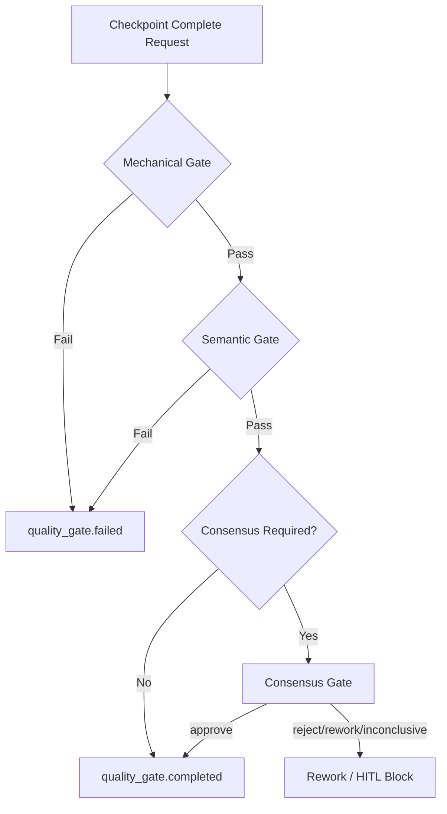

# LazyAntigravity

> **Durable Workflow Loops and Safety Consensus Gates for Autonomous Agents in Google Antigravity.**

---

## What is LazyAntigravity?

**LazyAntigravity** is a robust agent harness plugin package designed for the Google Antigravity developer platform. It empowers LLM-based autonomous developer agents to perform complex, multi-step tasks systematically without losing context, violating safety rules, or overflowing token quotas.

By enforcing the **Ouroboros Guard** control plane architecture, it integrates:
- **Durable Workflow Loops** (`/ulw`) using append-only lineage tracking.
- **Three-Stage Quality Gates** that verify mechanical, semantic, and consensus-based criteria.
- **Sandboxed Multi-Persona Consensus Panels** to validate high-risk modifications.
- **Quota Resilience** with checkpoint-resume flows matching Google Antigravity runtime bounds.

This project is tailored to Google Antigravity's `invoke_subagent` semantics and uses oh-my-openagent modules to govern code modification safely.

---

## Quick Start

Get LazyAntigravity installed and compiled locally:

```bash
# 1. Clone the repository
git clone https://github.com/daeryundf2-prog/LAZYANTIGRAVITY.git
cd LAZYANTIGRAVITY

# 2. Install root dependencies
npm install

# 3. Install plugin dependencies
npm ci --prefix plugins/omo

# 4. Build the omo plugin components
npm run build --prefix plugins/omo

# 5. Install the plugin into the Google Antigravity environment
node bin/lazyantigravity.js install
```

---

## Verify Installation

Ensure all tests pass and the drift verification checks are successful:

```bash
# 1. Run root package verification tests
npm test

# 2. Run the strict drift verification script
npm run verify:drift -- --strict

# 3. Compile the omo plugin components
npm run build --prefix plugins/omo

# 4. Run the components unit and integration tests
npm test --prefix plugins/omo/components/ulw-loop

# 5. Execute a dry-run happy-path scenario validation
node plugins/omo/components/ulw-loop/dist/cli.js ulw-loop dry-run --scenario happy-path --json
```

---

## Basic Usage

The primary entry point is the `/ulw` slash command in the Google Antigravity developer chat interface. This launches the workflow loop to decompose a task autonomously. 

During execution, subagents write progress checkpoints and read/append to an event ledger. In the event of a network failure or a quota limit, the workflow halts safely, allowing you to manually switch models in the UI and resume via `/ulw resume`.

---

## Core Safety Model

LazyAntigravity implements a strict model policy tailored to Google Antigravity's runtime capabilities:

- **Autonomous Role Routing**: The workflow can automatically partition work into roles (planner, researcher, worker, verifier).
- **No Model Auto-Routing**: Per-role automatic model switching via API is disabled (`canAutoRoute = false`). Google Antigravity does not support automatic model switching via API calls.
- **Subagent Model Inheritance**: All spawned subagents inherit the model currently selected by the user in the UI dropdown (`MODEL_TIER_INHERIT`).
- **Manual Model Swapping**: If a quota limit is reached, model swapping must be performed manually by the user in the Antigravity UI.
- **Strict Configuration Constraints**: The flag `wouldSwitchModel = false` is strictly enforced to prevent automated switching.

---

## Ouroboros Guard Architecture

### 1. Three-Stage Quality Gate Pipeline

Every completed goal checkpoint request must pass three verification stages before finalization is permitted:



- **Mechanical Gate**: Inspects the evidence envelope to ensure changes (e.g., `filesChanged`) have corresponding test execution evidence (e.g., `commandsRun` containing `test`).
- **Semantic Gate**: Validates that worker summaries are non-empty, checks for auto-switching violation claims, and verifies that no unresolved stagnation events are pending in the ledger.
- **Consensus Gate**: Sojourn multi-persona validation for high-risk modifications (such as modifications of core security configs, destructive file actions, or massive diffs).

---

### 2. Consensus Aggregation Rule

When consensus is required, the **Consensus Dispatcher** spawns four subagents representing distinct personas (Advocate, Devil's Advocate, Regression Reviewer, Security-State Reviewer) to inspect the changes. 

Let $V_i \in \{\text{approve}, \text{reject}, \text{needs-rework}, \text{inconclusive}\}$ be the verdict of voter $i$ for $i \in \{1, 2, 3, 4\}$.
The aggregated verdict $V_{agg}$ is calculated as follows:

- **Consensus Failed**: If $\exists i$ such that $V_i = \text{reject}$, then $V_{agg} = \text{failed}$ (Finalization blocked).
- **Consensus Rework Required**: If $\exists i$ such that $V_i = \text{needs-rework}$ (and no voter rejected), then $V_{agg} = \text{rework-required}$ (Goal remains `in_progress`, worker is asked to perform a correction loop).
- **Consensus Inconclusive**: If $\exists i$ such that $V_i = \text{inconclusive}$ (or a voter session times out / returns a schema violation), then $V_{agg} = \text{inconclusive}$ (Finalization blocked, transitions to HITL state `needs_user_decision`).
- **Consensus Passed**: If $\forall i, V_i = \text{approve}$, then $V_{agg} = \text{passed}$ (Finalizer allowed, finalization proceeds).

> [!IMPORTANT]
> **Parent-Owned State Principle**:
> - `consensus_passed` is **not** equivalent to `run.completed`.
> - `consensus_failed` is **not** equivalent to `run.failed`.
> - `consensus_rework_required` is **not** equivalent to `run.failed`.
> - Consensus only determines the `finalizerAllowed` flag. The global run state and final execution completion/failure are **strictly owned by the Parent Agent and the Control Plane**.
> - Subagents are strictly sandboxed (`mayFinalizeRun = false`, `mayChangeModel = false`, `wouldSwitchModel = false`). Any subagent attempting to assert `run.completed` or `run.failed` directly is rejected by the validation envelope.

---

## Slash Commands

LazyAntigravity registers dedicated shortcuts inside the Antigravity chat UI:

- `/ulw <task>` (or `/ulw-loop <task>`): Triggers the durable planning, discovery, execution, verification, and finalization loop.
- `/init-deep`: Recursively creates structured `AGENTS.md` context landmarks across directory hierarchies to guide subagent context retention.

---

## CLI Reference

The `omo` command-line tool operates on local run states using the following structure:

### Path Conventions:
- **Event Ledger**: `.lazycodex/runs/<runId>/events.jsonl` (raw append-only JSONL event history).
- **Run State**: `.lazycodex/runs/<runId>/state.json` (reconstructed session schema).
- **Backups**: `.lazycodex/runs/<runId>/backups/` (saved data snapshots during destructive rollbacks).

### Core Commands:

```bash
# Submit a goal completion checkpoint with verification evidence
omo ulw-loop checkpoint --goal-id <id> --status complete --evidence "..."

# Resume an interrupted workflow loop after manual model refresh
omo ulw-loop resume

# Append-only branch rewind to a specific event ID
omo ulw-loop rewind --event-id <event-uuid>

# Destructive rewind (creates a backup file and truncates events.jsonl)
omo ulw-loop rewind --event-id <event-uuid> --destructive

# Repair malformed/corrupted lines in events.jsonl and replay state
omo ulw-loop repair

# Check the current workflow state and get JSON-formatted output
omo ulw-loop status --json
```

---

## Limitations

- **No Automatic Model Switching**: Due to Google Antigravity architecture limits, model changes must be done manually by the user. Fallback lists are suggestions, not automated actions.
- **Dry-run Restrictions**: Running `dry-run` or validation checks in dry-run mode will **never** perform actual model API calls, modify source files, or affect UI/file system outputs.
- **Consensus Verdict Scope**: The consensus verdict only determines `finalizerAllowed`. It does not transition the global run state to `run.completed` or `run.failed`.
- **Packaging and Execution**: This repository is designed to be checkout-based for local development and build verification. However, the npm package itself acts as an installation binary wrapper and does not require a full repo checkout for end-user execution.

---

## Development / Testing

The codebase utilizes Biome for linting and formatting, Vitest for component unit tests, and Node's test runner for package validation.

```bash
# Run Biome lint checks
npx biome check .

# Run component tests
npm test --prefix plugins/omo/components/ulw-loop
```

---

## Release Notes

### v0.4.0 — Ouroboros Guard Core
- Shipped the strict 3-stage quality gate verification pipeline.
- Implemented Multi-Persona Consensus panels for high-risk validation.
- Added Stagnation Guard logic to block looping after 3 failed retries.
- Integrated W3C traceId/traceParent propagation and latency metrics.
- Added ledger repair utility and append-only lineage rewinding.
- Translated all skills and README documents to English, and removed legacy references.

---

## License

This project is licensed under the MIT License.
