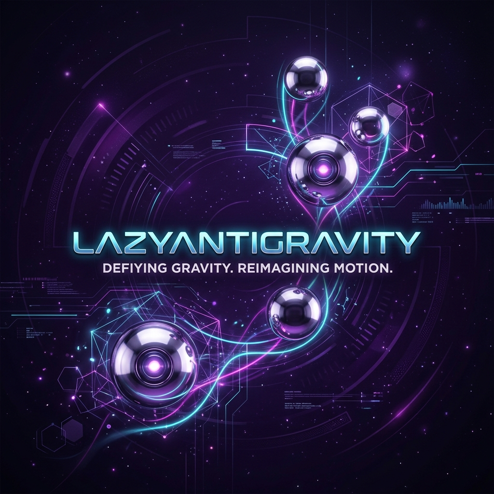

<div align="center">
  

  <h1>LazyAntigravity</h1>

  <p><strong>The one and only agent harness for complex codebases.</strong><br />
  Project memory, planning, execution, and verified completion inside Google Antigravity and Codex.</p>

  <p>
    <a href="https://lazycodex.ai">
      
    </a>
  </p>

  <p>
    <a href="#-what-is-this">What is this?</a>
    ·
    <a href="#%EF%B8%8F-antigravity-integration">Antigravity Integration</a>
    ·
    <a href="#-token--quota-safety">Token & Quota Safety</a>
    ·
    <a href="https://github.com/code-yeongyu/oh-my-openagent">OmO Core</a>
  </p>

  <br />
</div>

<hr />

> [!NOTE]
> **LAZYANTIGRAVITY**는 [lazycodex.ai](https://lazycodex.ai)를 오마주하여 제작된 **Google Antigravity** 및 **Codex** 플랫폼용 에이전트 하네스 플러그인 패키지입니다.
> 
> 기존 Codex 플랫폼의 대표적인 협업 에이전트 오케스트레이터인 **LazyCodex**의 철학을 이어받아, Antigravity의 `invoke_subagent` 플로우 및 쿼터 제한 환경에 완벽하게 적응하도록 이식 및 최적화되었습니다.

> [!IMPORTANT]
> **[OmO] 60K Stars: the quality-obsessed agent harness is now inside Google Antigravity.**
>
> Sisyphus Labs의 OmO 하네스는 엄격한 품질 게이트와 자율적인 에이전트 협업 시스템을 제공합니다. 이제 LazyAntigravity를 통해 복잡한 세정 없이 한 줄로 이 모든 기능과 안전화 설계를 사용할 수 있습니다:
>
> ```bash
> node bin/lazyantigravity.js install
> ```

---

## 🚀 Install

단 한 줄의 명령어로 플러그인을 환경에 맞춰 빌드하고 복사/설정합니다.
```bash
node bin/lazyantigravity.js install
```
이 스크립트는 모든 컴포넌트(`ulw-loop`, `lsp`, `rules` 등)를 빌드하고, 사용자 프로필 디렉터리(`~/.gemini/config/plugins/lazyantigravity`)에 최신 바이너리와 스킬 파일을 자동 배포합니다.

---

## ⚡ Commands & Workflows

LazyAntigravity는 플랫폼에 따라 최적화된 명령 방식을 지원합니다:

### 1. Antigravity Slash Command `/ulw`
- Antigravity 챗 UI 내에서 `/ulw <task>`를 입력하면 `ulw-loop`가 자율적으로 실행됩니다.
- **자동 역할 라우팅(Role Routing)**: Planner → Researcher → Worker → Verifier → Finalizer 단계로 작업이 분해되어 각 하위 에이전트가 병렬 또는 직렬로 순차 수행됩니다.
- **모델 상속**: Antigravity의 제한으로 모델이 자동 스위칭되지 않으며, 모든 서브에이전트는 현재 사용자가 UI에서 지정한 모델을 상속받아 동작합니다.

### 2. CLI 명령어 (`omo ulw-loop`)
로컬 개발 프로세스 및 자율 루프 검증을 위한 CLI 명령들을 제공합니다:
```bash
# 새로운 계획 수립 및 목표 설정
omo ulw-loop create-goals --brief "구현 요건 설명"

# 현재 루프 진행 상황 및 성공 조건 판정 상태 확인
omo ulw-loop status

# 다음 미완료 목표 획득 및 실행 지침 출력
omo ulw-loop complete-goals

# 검증 완료 후 개별 성공 조건 체크포인트 기록
omo ulw-loop checkpoint --goal-id G001 --status complete --evidence "증거 설명" --codex-goal-json <get_goal_json>

# 토큰/쿼터 오류 발생 시 에이전트의 현재 작업 세션 수동 저장
omo ulw-loop save-role-checkpoint --task-id <id> --platform <platform> --selected-model <model> --completed-roles <roles> --current-role <role> --next-recommended-action <action> --resume-command <cmd>

# 가장 최신 세션 체크포인트로부터 작업 재개
omo ulw-loop resume
```

---

## 🧠 Antigravity Quota-Aware Model Recommendations

Antigravity의 실시간 모델 추천은 플랫폼의 가용 쿼터를 파악하여 지능적으로 분기 제안됩니다:

- **충분한 Claude quota 보유 시**: `Claude Opus 4.6 (Thinking)`
- **Claude quota가 제한된 상태일 시**: `Gemini 3.1 Pro (High)`
- **대규모 탐색 위주 작업 시**: `Gemini 3.5 Flash (High)`
- **빠른 코드 수정 위주 작업 시**: `Gemini 3.5 Flash (Medium)`

### ⚠️ Fallback 수동 추천 순서
실행 도중 한도가 도달할 경우, 에이전트는 즉시 대기 상태로 진입하며 아래와 같은 구체적인 Fallback 전환을 사용자에게 추천합니다:
1. **Claude Opus 제한 시**: `Gemini 3.1 Pro (High)` ➡️ `Claude Sonnet 4.6 (Thinking) (Sonnet 쿼터 있을 시)` ➡️ `Gemini 3.5 Flash (High)`
2. **Claude Sonnet 제한 시**: `Gemini 3.1 Pro (High)` ➡️ `Gemini 3.5 Flash (High)`
3. **Gemini Pro 제한 시**: `Gemini 3.5 Flash (High)` ➡️ `Gemini 3.5 Flash (Medium)`
4. **모든 가용 모델 소진 시**: 다음 쿼터 초기화 시각까지 대기를 권장하거나, 사용자가 원하는 경우 **AI Credit Overages**를 계정 설정에서 활성화하도록 안내합니다. *(비용 요금 부과 위험이 있으므로 에이전트가 임의로 Overages 설정을 조작하지 않습니다).*

---

## 🛡️ Token & Quota Safety

대형 코드베이스 작업 중 발생할 수 있는 토큰 및 크레딧 소진 문제를 최소화하기 위해 다음의 3중 방어막이 가동됩니다:

### 1. Safe-Resume 체크포인트
- 오류가 발생하면 그 즉시 실행을 중단하고 `.lazycodex/checkpoints/ulw-{timestamp}.json` 파일에 실행 컨텍스트(수정된 파일 목록, 실행한 CLI 명령어, 생성된 아티팩트, 완료된 역할 및 실패한 역할 등)를 저장합니다.
- 사용자는 수동으로 드롭다운에서 가용 모델로 전환한 후 `/ulw resume`을 입력하면 이전 작업의 중복 소모 없이 실패 지점부터 이어서 작업을 계속해 나갈 수 있습니다.

### 2. Compact Mode (컨텍스트 초과 대처)
- 컨텍스트 크기가 한도에 임박하거나 초과(`context_window_exceeded`)되면 로그 요약 기법이 활성화됩니다.
- 변경이 필요하지 않은 코드 파일을 지면 단위로 로드하지 않고, 구문 타겟 slices만 추출하여 수정 도구에 주입합니다.
- 서브에이전트의 출력 양을 20~40줄 수준으로 압축하고, 전체 산출물은 로컬 아티팩트 파일로 보관하여 메모리 사용량을 줄입니다.

### 3. Batch Mode (출력 토큰 제한 대처)
- 대규모 패치가 한 번에 수정될 수 없는 상황(`output_token_limit`)이 예측되면, 작업 단위를 여러 조각의 배치(batches)로 자동 분할합니다.
- 각 분할 배치마다 독립적인 빌드 검증 및 린트를 통과시키며, 배치 성공 시마다 내부 체크포인트를 점진적으로 저장해 나갑니다.

---

## 👷 Maintainer & Homage

- **LazyAntigravity**는 **Jobdori**가 Google Antigravity 및 Codex 플러그인 호환성 유지보수를 위해 빌드하고 배포합니다.
- 본 프로젝트는 [lazycodex.ai](https://lazycodex.ai)의 아이디어와 [oh-my-openagent](https://github.com/code-yeongyu/oh-my-openagent) 에이전트의 엄격한 품질 지율에 깊은 존경을 보냅니다.

## 📄 License

MIT License
