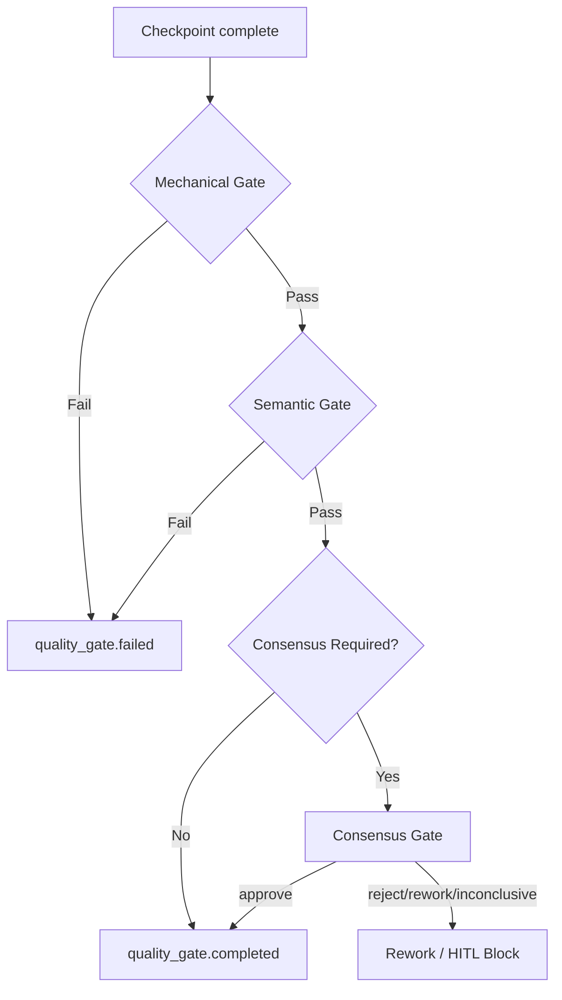

<div align="center">
  

  <h1>LazyAntigravity</h1>

  <p><strong>The ultimate agent harness for complex codebases inside Google Antigravity.</strong><br />
  Project memory, planning, execution, and verified completion using Google Antigravity subagents.</p>

  <p>
    <a href="#-install">Install</a>
    ·
    <a href="#-architecture--logical-foundations">Architecture & Logic</a>
    ·
    <a href="#-workflows--slash-commands">Slash Commands</a>
    ·
    <a href="#-cli-usage-guide">CLI Usage</a>
    ·
    <a href="#-token--quota-safety">Quota Safety</a>
  </p>

  <br />
</div>

<hr />

> [!NOTE]
> **LAZYANTIGRAVITY** is a state-of-the-art agent harness plugin package designed specifically for the Google Antigravity platform.
> 
> It provides complex codebase analysis, multi-agent autonomous collaboration, strict quality gate controls, and API quota overrun mitigation optimized for Google Antigravity's `invoke_subagent` flow.
>
> This project is designed to adapt robust autonomous developer workflows to the Antigravity architecture, relying on oh-my-openagent components to execute reliable, structured goals.

---

## 🚀 Install

Build and deploy the plugin components to your Google Antigravity environment with a single command:
```bash
node bin/lazyantigravity.js install
```
This script builds all underlying components (`ulw-loop`, `lsp`, `rules`, etc.) and automatically synchronizes the latest binaries and skill files to your user profile directory (`~/.gemini/config/plugins/lazyantigravity`).

---

## 📐 Architecture & Logical Foundations

LazyAntigravity is built around the **Ouroboros Guard** framework. It acts as an orchestrator and validator that guides LLM-based developers (subagents) through strict verification and safety gates.

### 1. Three-Stage Quality Gate Pipeline

Every checkpoint completion request (`omo ulw-loop checkpoint --status complete`) goes through a sequential 3-stage validation pipeline:



- **Stage 1: Mechanical Gate**
  - Validates the integrity of the evidence envelope.
  - Inspects `commandsRun` and `filesChanged` from the subagent's execution context.
  - If a file is changed but no verification commands (like `npm test`) are run, the gate fails.
- **Stage 2: Semantic Gate**
  - Analyzes the semantic goals and the summary generated by the worker.
  - Ensures the summary is non-empty and logically matches the files modified.
  - Blocks model auto-switching inside Google Antigravity (`wouldSwitchModel = true` triggers failure).
  - Inspects the 원장 (Ledger) to check if unresolved stagnation events are pending.
- **Stage 3: Consensus Gate**
  - Triggered automatically on high-risk actions (e.g., changes to auth/security code, large PRs, or destructive database operations).
  - Spawns the Multi-Persona Consensus Panel to reach agreement.

---

### 2. Multi-Persona Consensus Logic

When a task requires consensus, the **Consensus Dispatcher** spawns four sandboxed subagents representing distinct personas to analyze the proposed change from different angles:

1. **Advocate**: Highlights the value, architectural soundness, and benefits of the change.
2. **Devil's Advocate**: Searches for edge cases, architecture flaws, and potential runtime issues.
3. **Regression Reviewer**: Inspects compatibility, side effects, and potential regression risks in existing tests.
4. **Security-State Reviewer**: Evaluates concurrency, authorization holes, state corruption, and credential leaks.

#### Consensus Aggregation Rule:
Let $V_i \in \{\text{approve}, \text{reject}, \text{needs-rework}, \text{inconclusive}\}$ be the verdict of voter $i$ for $i \in \{1, 2, 3, 4\}$.
The aggregated verdict $V_{agg}$ is calculated as follows:

- **Consensus Failed**: If $\exists i$ such that $V_i = \text{reject}$, then $V_{agg} = \text{failed}$ (Finalizer blocked, status set to `failed`).
- **Consensus Rework Required**: If $\exists i$ such that $V_i = \text{needs-rework}$ (and no voter rejected), then $V_{agg} = \text{rework-required}$ (Goal remains `in_progress` (rework_required), worker is asked to fix reported issues).
- **Consensus Inconclusive**: If $\exists i$ such that $V_i = \text{inconclusive}$ (or a voter session timed out / failed to return a valid schema), then $V_{agg} = \text{inconclusive}$ (Finalizer blocked, transitions to HITL state `needs_user_decision`).
- **Consensus Passed**: If $\forall i, V_i = \text{approve}$, then $V_{agg} = \text{passed}$ (Finalizer allowed, status set to `complete`).

> [!WARNING]
> **Sandboxing Constraints**: To prevent model escaping, subagents are strictly sandboxed. 
> The properties `mayFinalizeRun`, `mayChangeModel`, and `wouldSwitchModel` are strictly set to `false`. 
> Any subagent returning `mayFinalizeRun=true` or claiming `run.completed` / `run.failed` in their output envelope will have their vote rejected.

---

### 3. Stagnation Guard & HITL (Human-in-the-Loop)

To prevent LLM worker agents from getting stuck in endless correction loops (stagnation), the **Stagnation Guard** tracks retry metrics based on the unique SHA-256 fingerprint of the worker's output files:

$$\text{Fingerprint} = \text{SHA256}(\text{evidenceEnvelope})$$

- If the **same fingerprint** is evaluated and returned as `rework_required` **more than 3 times**, it is classified as stagnation.
- The control plane instantly halts autonomous execution, appends a `parent.hitl_required` event to the ledger, and updates the goal status to `needs_user_decision`.
- This ensures human developers can intervene before excessive tokens or credits are burned.

---

### 4. Security: Sensitive Data Redaction

To prevent API keys, tokens, or credentials from leaking into the persistent ledger (`events.jsonl`), state (`state.json`), checkpoints, or console logs, a recursive **Sensitive Data Scrubber** sanitizes all data before it hits the disk.

The scrubber strips:
- **API Keys**: Matching `/(?:sk-|ghp_|gho_)[a-zA-Z0-9_-]{12,}/gi` (OpenCode/GitHub tokens).
- **JSON Web Tokens (JWT)**: Matching `\beyJ...` format.
- **Authorization Headers**: E.g., `Authorization: Bearer ...`.
- **Query Parameters**: E.g., `password=...`, `api_key=...`, `token=...`.
- All object keys containing `token`, `password`, `secret`, `credential`, `apikey`, `jwt`, `privatekey`.

---

### 5. Ledger Resilience & Recovery

- **Malformed JSONL Skip**: If the ledger file is corrupted due to sudden process termination (e.g., incomplete brackets), the parser ignores the corrupted lines and reads all valid events without crashing.
- **Ledger Repair Tool**: The `repair` CLI command removes malformed lines, reconstructs `state.json` via event replay, and saves a timestamped backup of the original raw ledger under `.omo/backups/`.
- **Append-Only Rewinding**: Unlike standard branch truncations, the `rewind` command preserves history by appending a `lineage.rewind_requested` and `lineage.branch_created` event, keeping a clear lineage path.

---

## ⚡ Workflows & Slash Commands

Once installed, the following dedicated slash commands become immediately available inside the Antigravity developer chat UI:

### 1. `/ulw <task>` (or `/ulw-loop <task>`)
- The core autonomous workflow loop used to execute complex, multi-step tasks.
- Triggers **Autonomous Role Routing** which decomposes the task into consecutive phases handled by dedicated subagents: Planner ➡️ Researcher ➡️ Worker ➡️ Verifier ➡️ Finalizer.
- All subagents automatically inherit the model currently selected by the user in the UI (`MODEL_TIER_INHERIT`).

### 2. `/init-deep`
- Scans the codebase directory structure hierarchically and generates an `AGENTS.md` context landmark file.
- Prevents agents from losing context in massive folder structures by providing local guidance files situated near the relevant code.

---

## 💻 CLI Usage Guide

The internal command-line tool `omo` is shipped inside components to manage workflows.

### 1. Recording Goal Progress & Verification
When a subagent completes a goal, it submits a checkpoint:
```bash
# Mark a goal as complete with verified evidence
omo ulw-loop checkpoint --goal-id <id> --status complete --evidence "Verified build and ran tests successfully." --codex-goal-json "./snapshot.json"

# Mark a goal as blocked when waiting on external authorization
omo ulw-loop checkpoint --goal-id <id> --status blocked --evidence "Awaiting admin access to deployment bucket."
```

### 2. State & Lineage Control
```bash
# Reconstruct state.json from ledger events and show current workflow status
omo ulw-loop status --json

# Rewind the workflow state to a specific event ID safely
omo ulw-loop rewind --event-id <event-uuid>

# Force rewrite events.jsonl to delete corrupted lines (destructive rewind backup)
omo ulw-loop rewind --event-id <event-uuid> --destructive
```

### 3. Ledger Health
```bash
# Repair a corrupted events.jsonl ledger file
omo ulw-loop repair
```

---

## 🛡️ Token & Quota Safety

A triple-layer defense mechanism is implemented to ensure work progress is never lost during token exhaustion or API rate limit events.

### 1. Safe-Resume Checkpointing
- In case of an API error, `save-role-checkpoint` is triggered immediately, saving the completed roles and changed files to `.lazycodex/checkpoints/` before pausing.
- The user can then switch the active model in the Antigravity UI dropdown and run `/ulw resume` to seamlessly pick up where the workflow left off.
- **Recommended Fallback Sequence**:
  - **Claude Opus limited**: `Gemini 3.1 Pro (High)` ➡️ `Claude Sonnet 4.6 (Thinking)` (if Sonnet quota is available) ➡️ `Gemini 3.5 Flash (High)`
  - **Claude Sonnet limited**: `Gemini 3.1 Pro (High)` ➡️ `Gemini 3.5 Flash (High)`
  - **Gemini Pro limited**: `Gemini 3.5 Flash (High)` ➡️ `Gemini 3.5 Flash (Medium)`
  - **All models exhausted**: Wait for rate-limit refresh, or manually enable `AI Credit Overages` in user settings (the agent will never enable this automatically).

### 2. Compact Mode (Context Saving)
- If `context_window_exceeded` is detected, the agent shifts to compact mode, reading only specific lines of code slices instead of printing full files.
- Role outputs are truncated to summaries (20–40 lines), and large file artifacts are referenced via local paths rather than dumped directly into the context window.

### 3. Batch Mode (Output Token Limits)
- When changes exceed the output token limits, modifications are split into multiple patch batches, verified incrementally, and checkpointed progressively.

---

## 👷 Maintainers & Support

- **LazyAntigravity** is maintained and built by **Sisyphus Labs** to preserve plugin compatibility and agent autonomy within the Google Antigravity harness environment.

## 📄 License

This project is licensed under the MIT License.
