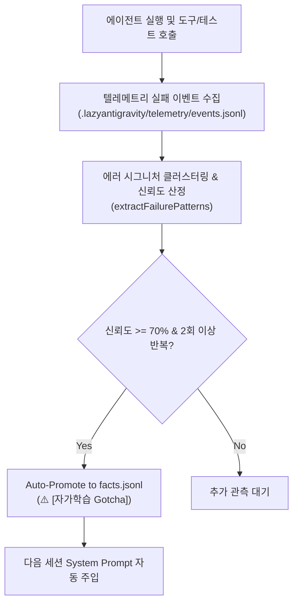

# active-learning


## How it works (from the former active-learning skill)

# Active-Learning: Telemetry-Driven Rule Evolution & Self-Healing Policy

에이전트가 반복적으로 겪는 실패 패턴(도구 인자 오류, 비동기 타임아웃, 타입 컴파일 에러)을 `.lazyantigravity/telemetry/`에서 능동 학습하여, `facts.jsonl`에 `⚠️ [AUTO-LEARNED GOTCHA]` 규칙으로 자동 승격하고 후속 세션에 선제적으로 적용하는 자가 진화 스킬입니다.



---

## CLI Commands

```bash
# 1. 텔레메트리 실패 패턴 분석
node ~/.gemini/config/plugins/lazyantigravity/components/active-learning/dist/cli.js analyze

# 2. Gotcha 규칙 자동 승격 및 메모리 동기화
node ~/.gemini/config/plugins/lazyantigravity/components/active-learning/dist/cli.js evolve
```
