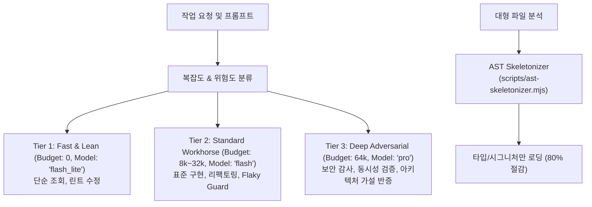

# adaptive-reasoning


## How it works (from the former adaptive-reasoning skill)

# Adaptive-Reasoning: Dynamic Thinking Budget & AST Skeletonizer

Gemini 3.7 Flash/Pro의 하이브리드 추론 능력을 극대화하기 위해, 작업 복잡도에 따라 Thinking Budget(0, 8k, 32k, 64k)과 모델 티어(Tier 1/2/3)를 동적으로 스케일링하고, 대용량 파일은 AST 스켈레토나이저로 함수 본문을 제거하여 컨텍스트를 80% 압축하는 스킬입니다.



---

## 3-Tier Adaptive Reasoning Routing

### 1. Tier 1: Fast & Lean (Low Complexity)
* **적용**: 단순 파일 조회, 오타 수정, 빠른 상태 체크
* **할당**: `Model: "flash_lite"`, `Thinking Budget: 0`

### 2. Tier 2: Standard Workhorse (Standard/High Complexity)
* **적용**: 기능 구현, 단위 테스트 작성, multi-agent ULW 오케스트레이션, UI Loopback
* **할당**: `Model: "flash"`, `Thinking Budget: 8,192 ~ 32,768`

### 3. Tier 3: Deep Adversarial (Mission-Critical / High Stakes)
* **적용**: 보안 침투 감사, 비동기 락 경합 격리, 클린 아키텍처 드리프트 방지
* **할당**: `Model: "pro"`, `Thinking Budget: 64,000`

---

## AST Skeletonizer Usage

대형 소스 코드를 에이전트 컨텍스트에 로드할 때 함수 구현부를 제외한 시그니처만 추출합니다:

```bash
# 파일 스켈레톤 추출 및 출력
node ~/.gemini/config/plugins/lazyantigravity/scripts/ast-skeletonizer.mjs src/services/auth.ts
```
