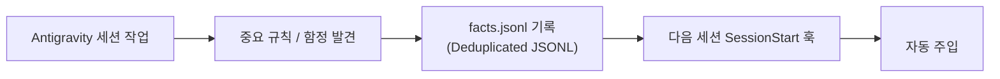

# memory


## How it works (from the former active-memory skill)

# Active-Memory: Local Working Memory & Facts Persistence

Antigravity 세션 간에 프로젝트의 중요한 컨벤션, 빌드 트릭, 아키텍처 제약 사항, 발견된 결함/함정(Gotcha)을 `.lazyantigravity/memory/facts.jsonl` (또는 `.omo/memory/facts.jsonl`)에 안전하게 기록하고 다음 세션 시작 시 자동으로 시스템 프롬프트에 주입하는 스킬입니다.



---

## Source and review metadata

`saveFact(content, category, filePath, metadata?)` accepts optional `source` text and `review` metadata. Saved and loaded facts always have `verificationStatus: "unverified"`, including legacy records claiming verified status. Review metadata never promotes a fact to verified evidence.

A review requires `reviewer`, `reviewedAt`, `decision` (`approved` or `rejected`), and `evidence: { file, sha256 }`. The evidence is a JSON receipt inside the facts file's directory, bound to the same reviewer, timestamp, decision, and `contentSha256` of the trimmed UTF-8 fact. Missing, mismatched, future-dated, oversized, or escaping receipts are rejected on save; invalid review metadata is discarded on read without losing the working fact. Duplicate saves cannot bypass review validation.

This is local provenance, not authenticated reviewer identity: anyone able to rewrite both facts and receipts is outside this trust boundary. Source text is also caller-supplied context, not verification. The `remember` CLI saves unreviewed facts; metadata is available through the library API.

## 사용법 (Usage)

### 1. 사실(Fact) 및 제약 사항 수동 기억하기
사용자가 특정 규칙을 항상 기억하길 원하거나, 에이전트가 중요한 프로젝트 함정을 학습했을 때:

```bash
node ~/.gemini/config/plugins/lazyantigravity/components/memory/dist/cli.js remember "이 프로젝트는 Jest 대신 vitest를 사용해야 합니다."
```

### 2. 저장된 메모리 목록 확인
```bash
node ~/.gemini/config/plugins/lazyantigravity/components/memory/dist/cli.js list
```

### 3. 카테고리 분류
- `📌 [FACT]`: 빌드 도구, 패키지 매니저, 디렉터리 구조 등 객관적 사실.
- `⚠️ [GOTCHA]`: 특정 함수/API 사용 시 주의해야 할 비동기 레이스나 런타임 제약.
- `⭐ [PREFERENCE]`: 사용자가 선호하는 코드 스타일 및 네이밍 규칙.
