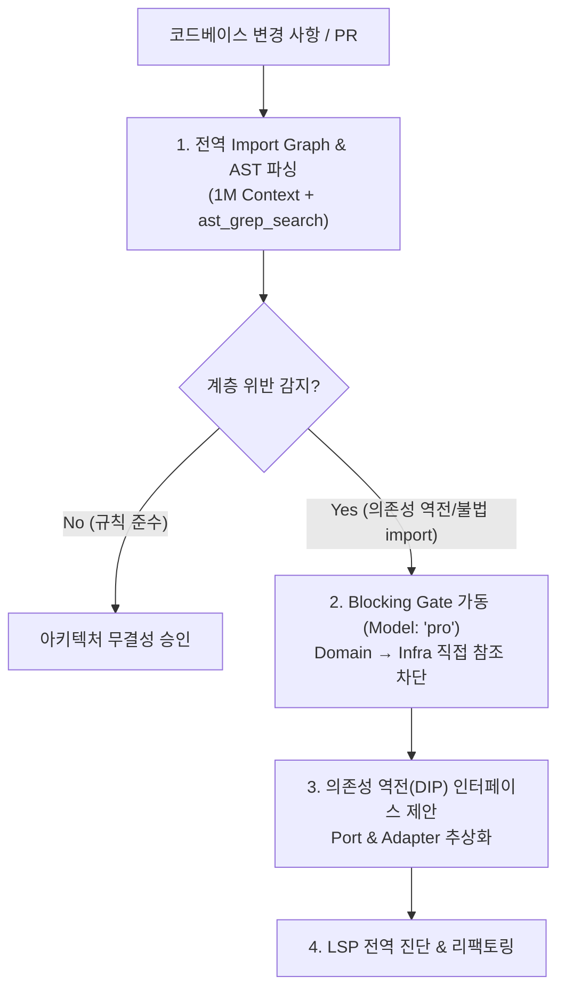

# Arch-Guard: Clean Architecture Boundary & Dependency Drift Enforcer

Gemini 3.8 Flash의 1M 컨텍스트 전역 분석과 AST Import Graph 분석을 결합하여, 모듈 간 불법적인 결합도 증가 및 아키텍처 계층 위반(Architecture Drift)을 실시간으로 감시하고 차단하는 스킬입니다.



---

## 4-Step Arch-Guard Workflow

### Step 1: Whole-Codebase Import Graph Mapping (전역 의존성 스캔)
전체 모듈 간 import 방향을 파싱하여 계층 다이어그램을 구성합니다.

- **Domain Layer**: 외부 프레임워크/DB/HTTP 라이브러리 import 금지
- **Application Layer**: Domain만 참조, Infra 직접 의존 금지 (인터페이스 주입)
- **Infrastructure Layer**: Application/Domain의 포트(Port) 구현체만 담당
- **Presentation / UI**: Controller/API만 호출, DB/Service 내부 구현 직접 우회 금지

### Step 2: Layer Boundary Inspection (오라클 검증)
`Model: "pro"`를 사용하여 계층 규칙 위반을 엄격히 판정합니다.

```
invoke_subagent(
  Subagents=[
    {
      TypeName: "self",
      Role: "Architecture Boundary Oracle",
      Model: "pro",
      Prompt: """REVIEW TYPE: CLEAN ARCHITECTURE DRIFT AUDIT
GOAL: Audit import graph and AST structure for architectural rule violations.

CHECKLIST:
1. Domain entity/value-object importing external DB/ORM or HTTP clients (Violation)
2. UI components directly importing internal data repositories bypassing API/Service (Violation)
3. Circular dependencies across modules
4. Leaky abstractions exposing infrastructure details to business core

OUTPUT FORMAT:
VERDICT: CLEAN | DRIFT_DETECTED
VIOLATIONS: specific import statements with file:line
REFACTORING: Dependency Inversion (DIP) abstraction interface proposal"""
    }
  ],
  toolAction: "Auditing architectural layer boundaries",
  toolSummary: "Architecture drift audit"
)
```

### Step 3: Dependency Inversion Refactoring (DIP 리팩토링)
불법 직접 참조를 인터페이스(Port) 기반 의존성 역전 구조로 리팩토링합니다.

### Step 4: Diagnostic Gate (무결성 검증)
`lsp_diagnostics_directory`를 실행하여 컴파일 무결성을 확인하고 아키텍처 규칙 통과를 선언합니다.
