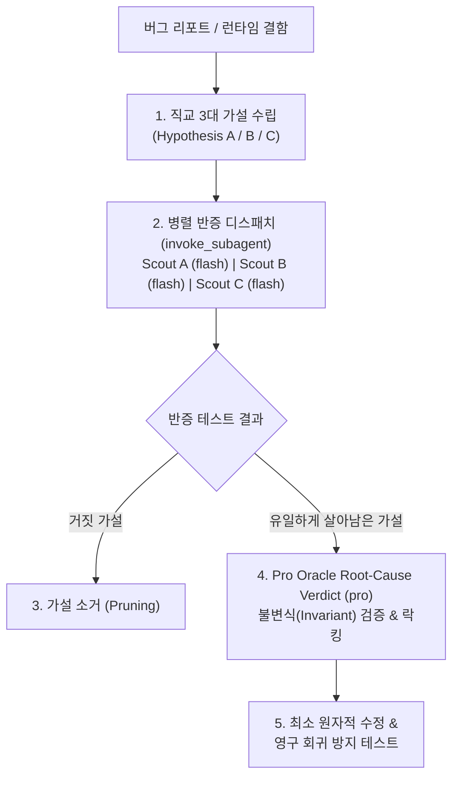

# Hypothesis-Tree: Parallel Falsification & Invariant Root-Cause Isolation

Gemini 3.7 Flash의 논리 분기(Branching CoT)와 초저지연 병렬성을 활용하여 복잡한 버그, 침묵 실패(Silent Failure), 동시성 레이스 컨디션에 대해 직교하는 3대 가설을 수립하고, 단일 턴에 병렬 반증(Falsification)하여 진짜 근본 원인(Root Cause)을 규명하는 디버깅 스킬입니다.



---

## 5-Step Hypothesis-Tree Workflow

### Step 1: Orthogonal Hypothesis Generation (직교 3대 가설 수립)
문제를 해결하기 전, 서로 겹치지 않는 상호 배타적(Mutually Exclusive) 가설 3가지를 도출합니다.
- **Hypothesis A (상태/데이터 경계)**: 입력 파라미터 변환, 직렬화/역직렬화, 널/미정의 상태 오염
- **Hypothesis B (동시성/타이밍/레이스)**: 비동기 실행 순서 꼬임, 이벤트 루프 지연, 락/트랜잭션 경쟁
- **Hypothesis C (환경/외부 의존성)**: 파일시스템 권한, 서드파티 API 계약 불일치, 런타임 환경 설정

### Step 2: Parallel Falsification Dispatch (병렬 반증)
각 가설을 거짓으로 증명하기 위한 독립적 반증 테스트를 `Model: "flash"` 서브에이전트 3인에게 병렬 디스패치합니다.

```
invoke_subagent(
  Subagents=[
    {
      TypeName: "self",
      Role: "Hypothesis A Falsifier",
      Model: "flash",
      Prompt: """TASK: Probe and falsify Hypothesis A (State/Data Boundary mutation).
ACTION: Write and execute a deterministic failing test targeting Hypothesis A.
DELIVERABLE: reproduction test command and observable pass/fail receipt.
SCOPE: targeted data transformations."""
    },
    {
      TypeName: "self",
      Role: "Hypothesis B Falsifier",
      Model: "flash",
      Prompt: """TASK: Probe and falsify Hypothesis B (Concurrency/Race condition).
ACTION: Write a high-load or out-of-order reproduction script targeting Hypothesis B.
DELIVERABLE: concurrency trace and execution receipt.
SCOPE: async control flow."""
    },
    {
      TypeName: "self",
      Role: "Hypothesis C Falsifier",
      Model: "flash",
      Prompt: """TASK: Probe and falsify Hypothesis C (Environment/Contract mismatch).
ACTION: Inspect environment variables, OS permissions, and external payload contracts.
DELIVERABLE: environment audit receipt.
SCOPE: configuration and external boundaries."""
    }
  ],
  toolAction: "Executing parallel hypothesis falsification",
  toolSummary: "Parallel hypothesis falsification"
)
```

### Step 3: Falsification & Pruning (소거법 검증)
반증에 실패한(실제 버그가 발생하지 않은) 가설은 즉시 폐기하고, 재현에 성공한 단일 가설만 격리합니다.

### Step 4: Pro Oracle Verdict & Invariant Lock (오라클 검증)
`Model: "pro"`를 호출하여 생존한 가설의 근본 원인을 비판적으로 재검증하고 불변식(Invariant) 회귀 테스트를 고정합니다.

```
invoke_subagent(
  Subagents=[
    {
      TypeName: "self",
      Role: "Root-Cause Oracle",
      Model: "pro",
      Prompt: """TASK: Critically confirm the isolated root cause and verify that the proposed invariant test fully prevents regression.
DELIVERABLE: confirmation verdict and invariant test contract.
SCOPE: workspace defect boundary."""
    }
  ],
  toolAction: "Confirming root cause via Pro Oracle",
  toolSummary: "Pro root-cause verification"
)
```

### Step 5: Minimal Fix & Verification (최소 수정 & 종결)
식별된 근본 원인에 대한 최소한의 원자적 수정만 적용하고 테스트 통과를 검증합니다.
