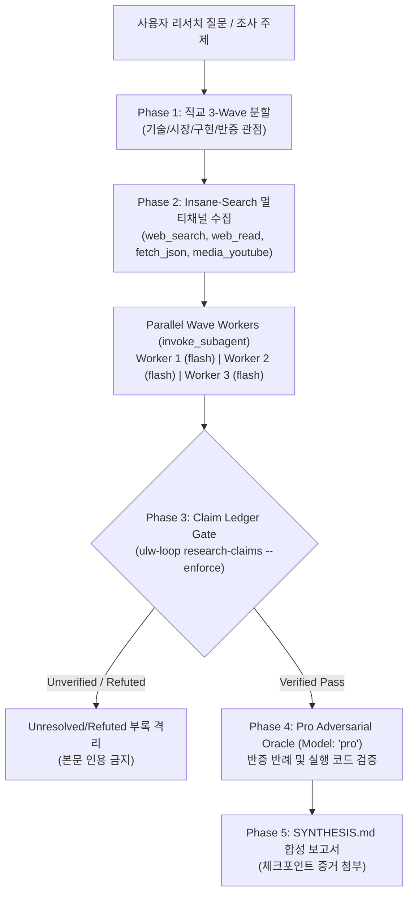

# Ultra-Research: Multi-Wave Parallel Discovery & Insane-Search Fact Gate

Gemini 3.7 Flash의 초저지연 병렬성과 1M 컨텍스트, 그리고 **Insane-Search의 12종 멀티채널 검색 기법**과 **Claim Ledger 기계적 게이트(`ulw-loop research-claims --enforce`)**를 결합하여, 단순 검색을 넘어선 학술·기술·시장 심층 리서치와 철저한 사실 교차 검증을 수행하는 엔터프라이즈급 리서치 파이프라인입니다.



---

## 5-Phase Ultra-Research Workflow

### Phase 1: Problem Decomposition & Wave 1 Parallel Dispatch
연구 주제를 최소 3개의 직교하는 탐색 각도(기술 아키텍처, 실증 벤치마크, 반대/한계점)로 분해하고, `invoke_subagent`를 통해 단일 턴에 병렬 디스패치합니다. 리서치 도구(`web_search`, `web_read`, `fetch_json`)는 `LAZYANTIGRAVITY_RESEARCH_NETWORK=1` 환경변수 옵트인을 통해 동작합니다.

```
invoke_subagent(
  Subagents=[
    {
      TypeName: "research",
      Role: "Architecture & Spec Scout",
      Model: "flash",
      Prompt: """TASK: Deep research on target architecture specifications and official documentation.
TOPIC: <query>
METHOD: Use web_search, web_read, and fetch_json with exact query operators and primary source lookups.
DELIVERABLE: Findings with primary source URLs and verbatim evidence snippets (<20 words)."""
    },
    {
      TypeName: "research",
      Role: "Benchmark & Empirical Scout",
      Model: "flash",
      Prompt: """TASK: Find real-world benchmark metrics, performance comparisons, and production case studies.
TOPIC: <query>
METHOD: Search technical engineering blogs, GitHub implementations, and academic papers."""
    },
    {
      TypeName: "research",
      Role: "Falsification & Limitation Scout",
      Model: "flash",
      Prompt: """TASK: Actively search for known issues, edge-case failures, community criticisms, and security CVEs.
TOPIC: <query>
METHOD: Conduct aggressive counter-search (e.g. site:github.com/issues OR site:reddit.com)."""
    }
  ],
  toolAction: "Dispatching Wave 1 parallel research swarm",
  toolSummary: "Wave 1 research swarm"
)
```

---

### Phase 2: Insane-Search Multi-Channel Search Craft

단순 키워드 검색에 의존하지 않고 고수율 채널 및 정밀 연산자를 활용합니다:

#### 1. Research Channels & Availability

| Channel | Method | Availability / Status | Notes |
|---|---|---|---|
| **Jina Reader** | `web_read(url)` | **Keyless (즉시 사용 가능)** | WAF 없는 일반 블로그/문서의 클린 마크다운 파싱 (`r.jina.ai`) |
| **Tavily Search** | `web_search(query)` | **Keyed (`LAZYANTIGRAVITY_TAVILY_KEY`)** | 고품질 LLM 검색 API |
| **Brave Search** | `web_search(query)` | **Keyed (`LAZYANTIGRAVITY_BRAVE_KEY`)** | 독립 웹 인덱스 검색 API |
| **Jina Search** | `web_search(query)` | **Keyed (`LAZYANTIGRAVITY_JINA_KEY`)** | LLM 친화형 마크다운 검색 |
| **DuckDuckGo** | `web_search(query)` | **Keyless Fallback** | 키 미설정 시 자동 폴백 (미제공 시 정직한 에러 반환) |
| **GitHub REST** | `fetch_json(url)` | **Keyless** | `api.github.com` 레포, 릴리즈, 이슈 직접 조회 |
| **Public APIs** | `fetch_json(url)` | **Keyless** | npm, PyPI, arXiv (`export.arxiv.org/api/query`) API |
| **Media / Subtitles**| `media_youtube(url)` | **Network Gated (`LAZYANTIGRAVITY_MEDIA_NETWORK=1`)** | 컨퍼런스/발표 영상 자막 및 메타데이터 추출 |

#### 2. Advanced Search Operators
| 연산자 | 예시 | 용도 |
|---|---|---|
| `site:` | `site:github.com <topic>` | 공식 레포/구현체 한정 |
| `filetype:` | `filetype:pdf <topic> benchmark` | 공식 백서, 논문, 스펙 |
| `intitle:` / `inurl:` | `intitle:"benchmarks" <topic>` | 핵심 제목 일치 |
| `"exact"` / `-term` | `"<exact error>" -deprecated` | 정밀 문구 매칭 및 노이즈 제거 |
| `after:` / `before:` | `<topic> after:2025-01-01` | 최신성(Recency) 강제 |

---

### Phase 3: Claim Ledger Data-Flow Lock (기계적 게이트: `ulw-loop research-claims`)

> **[CRITICAL PRINCIPLE: The Lock is Mechanically Enforced]**  
> 보고서 본문은 반드시 `Claim Ledger` 게이트를 통과한 주장만 인용할 수 있습니다. 증거가 부족하거나 반증된 주장은 절대 본문에 포함시키지 않고 `Unresolved Annex`로 격리하며, 납품 전 다음 명령어로 기계적 검증을 통과해야 합니다:
> ```bash
> lazyantigravity ulw-loop research-claims --file claim-ledger.md --synthesis SYNTHESIS.md --enforce
> ```

주장이 `VERIFIED`로 승인되기 위한 3대 필수 조건:
1. **2개 이상의 독립 도메인(Independent Source Domains)**에서 상호 입증될 것 (동일 도메인의 2개 페이지는 1개로 계산).
2. **반증 검색(Counter-Search)**을 명시적으로 수행하여 더 강력한 반례가 존재하지 않음을 확인할 것.
3. 2차 블로그 해설이 아닌 **1차 출처(Primary Source: 공식 문서, RFC, GitHub 소스, 논문)**가 뒷받침할 것.

#### `claim-ledger.md` 레코드 포맷:
| Claim | Risk Level | Sources (2+ Domains) | Counter-Search Result | Primary Source | Status |
|---|---|---|---|---|:---:|
| [Claim 1] Gemini 3.7 Flash supports dynamic 64k thinking budget | High | https://ai.google.dev, https://blog.google | Search for counter: verified in official docs | https://ai.google.dev/gemini-api/docs/models/gemini-3.7-flash | `VERIFIED` |
| [Claim 2] Library X crashes on Node 22 ESM | High | https://github.com/lib/issues/1, https://stackoverflow.com/q/2 | Refuted in release v2.4.1 fix | https://github.com/lib/releases/tag/v2.4.1 | `REFUTED` |

---

### Phase 4: Executable Code Verification & Pro Oracle Review

서로 다른 문서의 주장이 충돌하거나 성능/호환성 주장이 모호할 경우, 추측하지 않고 **직접 재현 코드를 실행**하여 검증합니다.

```
invoke_subagent(
  Subagents=[
    {
      TypeName: "self",
      Role: "Research Verification Oracle",
      Model: "pro",
      Prompt: """TASK: Adversarially review the research findings and resolve conflicting claims.
INPUT CLAIMS: <list of contested claims from Phase 3>
VERIFY: Check for logical fallacies, outdated API versions, or sample bias.
DELIVERABLE: Final unambiguous verdict (VERIFIED / REFUTED / PARTIAL) with grounded reasoning."""
    }
  ],
  toolAction: "Conducting Pro adversarial research verification",
  toolSummary: "Pro research oracle review"
)
```

---

### Phase 5: Structured Synthesis & Checkpoint Attachment (`SYNTHESIS.md`)

모든 탐색과 검증이 수렴(Convergence)하면, 최종 합성 보고서 `SYNTHESIS.md`를 작성합니다. 작성된 보고서는 `evidence-draft` 워크플로를 통해 ulw-loop 체크포인트의 `--quality-gate-json` 증거로 연결할 수 있습니다:

```markdown
# Ultra-Research Synthesis: <Research Topic>
- **Workers**: 3 Parallel Swarm Waves
- **Verified Claims**: <N> / <Total>
- **Primary Sources**: <Count>

## 1. Executive Summary
(핵심 질문에 대한 2~3개 단락의 명확하고 실용적인 답변)

## 2. Findings by Theme
- **Theme 1: Core Architecture & Implementation**:
  - [Claim 1]에 따른 핵심 매커니즘 설명...
  - [Claim 2]에 대한 반증 및 해결 내역...

## 3. Verified Claims vs Contradictions
| Claim | Verification Evidence | Status |
|---|---|:---:|
| [Claim 1] ... | ... | `VERIFIED` |

## 4. Unresolved / Refuted Annex
(기준 미달 또는 반증된 주장 목록 및 사유)

## 5. Ranked Sources & References
1. [Claim 1 Source] URL - 설명, 신뢰도 등급, 접근일시
```

---

## Failure Modes & Hard Rules
1. **단일 Wave 조기 종료 금지**: 최소 2 Wave 이상의 확장 탐색을 거쳐야 함.
2. **독립 소스 교차 검증 없는 인용 금지**: 1개 블로그 글의 주장은 단독 사실로 취급 금지.
3. **영문 검색 우선 원칙**: 기술/학술 리서치는 가장 방대한 영문 코퍼스를 우선 스위프.
4. **기계적 게이트 통과 의무**: `ulw-loop research-claims --enforce` 통과 없이는 합성 보고서 납품 불가.
