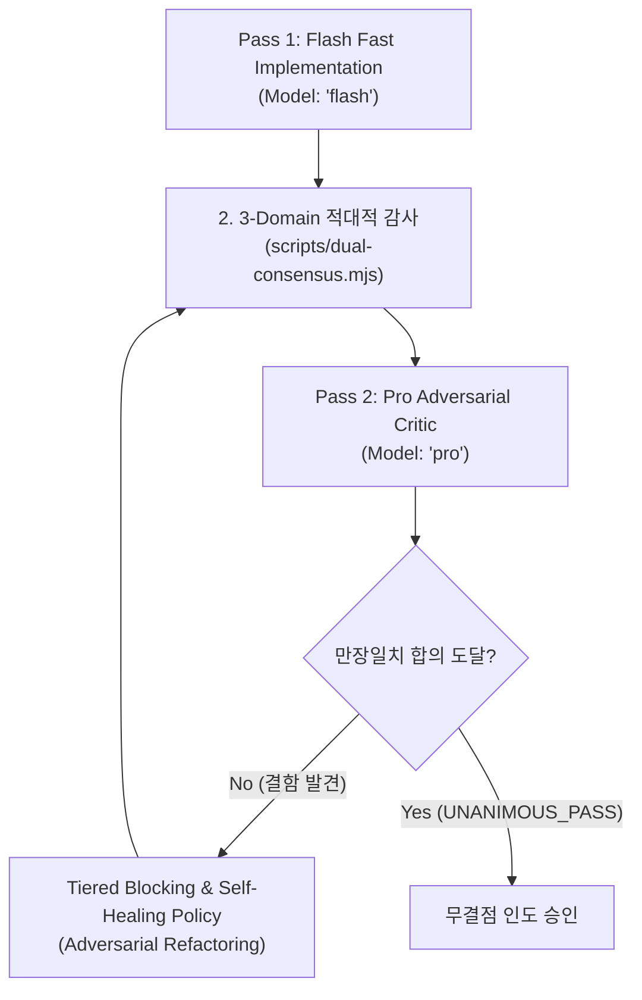

# Dual-Verify: 2-Pass Real-Time Co-Verification

코드 구현 직후 `Model: "flash"`의 초저지연 구현 결과물을 바탕으로, `Model: "pro"` 오라클 및 `dual-consensus.mjs`가 3대 적대적 영역(① 보안/인젝션, ② 동시성/비동기 레이스, ③ 경계 계약/타입 안전성)을 집중 감사하여 만장일치(Unanimous Pass) 합의에 도달했을 때만 배포를 승인하는 2-Tier 품질 보증 게이트입니다.



---

## 2-Pass Verification Protocol

### Pass 1: Flash Fast Implementation
초고속으로 핵심 비즈니스 로직과 단위 테스트를 작성합니다 (`Model: "flash"`).

### Pass 2: Pro Adversarial Critic
Pro 모델 오라클이 코드의 잠재적 취약점을 공격적으로 분석합니다 (`Model: "pro"`).

```
invoke_subagent(
  Subagents=[
    {
      TypeName: "self",
      Role: "Adversarial Code Critic",
      Model: "pro",
      Prompt: """REVIEW TYPE: 3-DOMAIN ADVERSARIAL CONSENSUS
1. Security: SQLi, command injection, path traversal, untrusted inputs.
2. Concurrency: unawaited promises, race conditions, lock deadlocks.
3. Boundary: exhaustive matches, no 'as any', null safety."""
    }
  ],
  toolAction: "Executing Pro adversarial audit",
  toolSummary: "Pro adversarial review"
)
```

### Tiered Blocking & Self-Healing Policy
- `P0 (Critical Security)`: 즉각 블로킹 및 긴급 자동 수정.
- `P1 (Concurrency Hazard)`: 비동기 레이스 수정 전까지 커밋 금지.
- `P2 (Type/Boundary Gap)`: 점진적 하드닝.

### 3-Domain Consensus CLI
```bash
node ~/.gemini/config/plugins/lazyantigravity/scripts/dual-consensus.mjs src/
```
