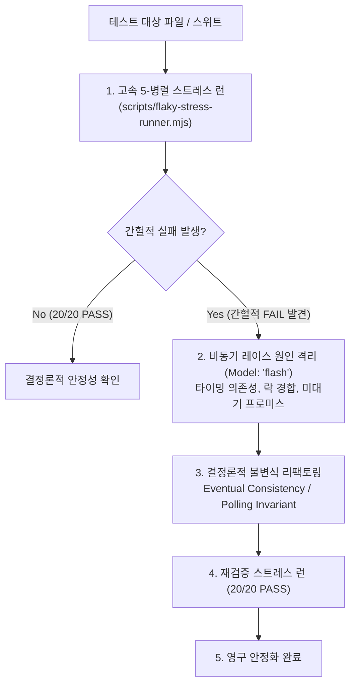

# Flaky-Guard: Self-Healing Non-Deterministic Test Hardener

Gemini 3.7 Flash의 초저지연 병렬 실행력과 `flaky-stress-runner.mjs`를 활용하여 테스트 스위트를 5개 동시 병렬 프로세스로 20회 고속 스트레스 런하고, 비동기 타이밍 의존성(`setTimeout`, microtask 미대기, 포트 경합)으로 인해 간헐적으로 실패하는 Flaky Test를 자동으로 포착하여 결정론적(Deterministic) 구조로 자가 치유하는 스킬입니다.



---

## 4-Step Flaky-Guard Workflow

### Step 1: Parallel Stress Runner (5-병렬 20회 스트레스 런)
동일 테스트를 고속으로 반복 실행하여 간헐적 실패를 재현하고 실패 로그를 수집합니다.

```bash
# 기본 5병렬 20회 스트레스 런
node ~/.gemini/config/plugins/lazyantigravity/scripts/flaky-stress-runner.mjs "npm test"

# 특정 테스트 파일 대상 실행
node ~/.gemini/config/plugins/lazyantigravity/scripts/flaky-stress-runner.mjs --concurrency=5 --iterations=20 "npm test -- test/auth.test.ts"
```

### Step 2: Flakiness Root-Cause Isolation (원인 격리)
`Model: "flash"`를 사용하여 실패 로그와 타이밍 트레이스를 분석합니다.

```
invoke_subagent(
  Subagents=[
    {
      TypeName: "self",
      Role: "Flaky Test Diagnostician",
      Model: "flash",
      Prompt: """TASK: Analyze intermittent test failure logs and identify timing race conditions.
CHECKLIST:
1. Arbitrary sleep/delay (setTimeout / time.sleep) vs deterministic event listeners
2. Shared global state / uncleaned DB records across test cases
3. Unawaited microtasks / floating Promises
4. Port / filesystem resource contention

DELIVERABLE: root cause analysis and deterministic replacement diff."""
    }
  ],
  toolAction: "Diagnosing flaky test timing hazards",
  toolSummary: "Flaky test diagnosis"
)
```

### Step 3: Deterministic Hardening (결정론적 리팩토링)
임의의 시간 지연(`setTimeout(100)`)을 조건부 폴링 또는 이벤트 완료 대기(Eventual Invariant)로 수정합니다.

### Step 4: Verification Stress Gate (재검증 20회 패스)
수정 후 20회 연속 실행에서 단 1건의 실패도 없음(`20/20 PASS`)을 확인하고 완료합니다.
