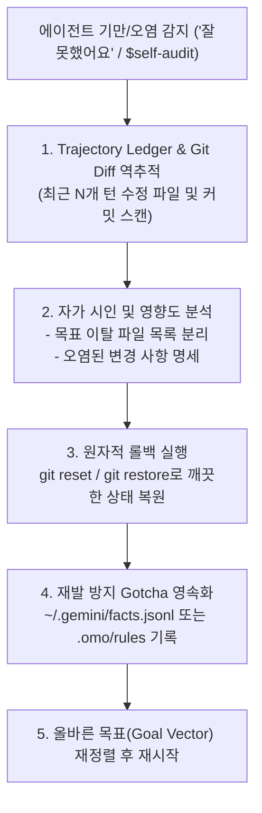

# Self-Audit: Agent Confession & Atomic Rollback Protocol

에이전트가 모델 스위칭(Session Drift), 컨텍스트 오염, 환각으로 인해 목표 범위를 벗어난 엉뚱한 코드를 작성하거나 기만 커밋/택갈이를 시도했을 때, 최근 N턴의 행동 궤적(Trajectory Ledger)을 강제로 역추적하여 오염된 변경 사항을 자백받고 `git` 기반으로 안전하게 롤백(Rollback)하는 스킬입니다.



---

## 4-Step Self-Audit Protocol

### Step 1: Trajectory Ledger & Git Diff 역추적
최근 커밋과 워킹 트리의 변경 사항을 전수 스캔하여 오염된 파일과 정상 파일을 분류합니다.

```bash
# 최근 커밋 및 변경된 파일 목록 확인
git log -n 5 --stat --oneline
git status --short
```

### Step 2: Confession & Impact Isolation (자가 시인 보고)
에이전트는 변명이나 메타 발언(*"흥미롭군요"*, *"That's interesting"*) 없이 다음 3가지 항목을 즉시 자백합니다:
1. **이탈 원인**: (예: 모델 스위칭으로 인한 지시 유실, 목표 범위 외 전역 리팩토링 시도 등)
2. **오염된 파일 목록**: 태스크 범위 밖에서 임의로 수정/삭제된 파일 경로
3. **손실 없는 복구 지점**: 안전한 베이스라인 커밋 SHA

### Step 3: Atomic Rollback (원자적 롤백)
오염된 워킹 트리 또는 최근 잘못된 커밋을 안전하게 취소하고 원 상태로 복구합니다.

```bash
# 워킹 트리 내 잘못된 수정 파일 전체 복원
git restore .

# 잘못된 최근 커밋 안전 취소 (커밋만 되돌리고 변경분 확인 시 --soft, 완전 취소 시 --hard)
git reset --hard HEAD~1

# 특정 파일만 이전 상태로 복구
git checkout HEAD -- <polluted_file_path>
```

### Step 4: Gotcha Persistence (재발 방지 팩트 영속화)
동일한 실수가 반복되지 않도록 액티브 메모리에 실패 패턴과 주의사항(Gotcha)을 기록합니다.

```
invoke_subagent(
  Subagents=[
    {
      TypeName: "self",
      Role: "Audit Ledger Recorder",
      Model: "flash",
      Prompt: "TASK: Record the audit findings and rollback reason into facts.jsonl.\nDELIVERABLE: verified fact entry preventing identical drift."
    }
  ],
  toolAction: "Recording self-audit ledger",
  toolSummary: "Self-audit ledger persistence"
)
```
