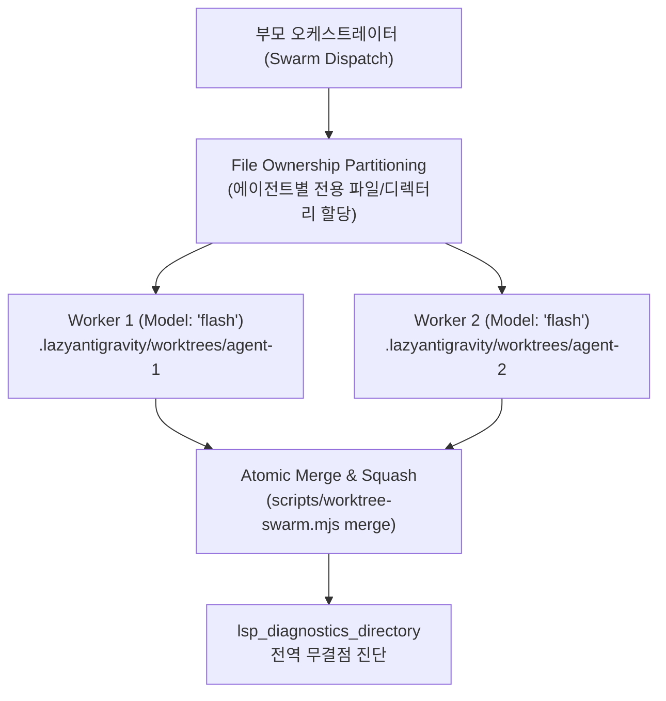

# Swarm-Sync: Partitioned Swarm Synchronization & Worktree Isolation

다수의 병렬 서브에이전트가 동시에 실행될 때 동일한 파일에 동시 쓰기를 시도하여 발생하는 파일 손상 및 Git 충돌을 원천 차단하기 위해, File Ownership Partitioning과 각 서브에이전트 전용 `git worktree` 격리 환경을 동적으로 프로비저닝하고 작업 완료 후 원자적으로 Atomic Merge하는 오케스트레이션 스킬입니다.



---

## 4-Step Swarm-Sync Workflow

### Step 1: File Ownership Partitioning & Worktree 격리
서브에이전트 실행 전 고유 작업 트리를 할당합니다:

```bash
node ~/.gemini/config/plugins/lazyantigravity/scripts/worktree-swarm.mjs create agent-auth-worker
```

### Step 2: 격리된 작업 트리에서 서브에이전트 실행
`Workspace: "branch"` 또는 격리된 디렉터리 경로를 지정하여 서브에이전트를 디스패치합니다.

```
invoke_subagent(
  Subagents=[
    {
      TypeName: "self",
      Role: "Swarm Worker",
      Model: "flash",
      Prompt: "TASK: Implement isolated auth tokens.\nSCOPE: .lazyantigravity/worktrees/agent-auth-worker"
    }
  ],
  toolAction: "Running isolated swarm worker",
  toolSummary: "Swarm worker execution"
)
```

### Step 3: Atomic Merge & 충돌 해소
작업 완료 후 격리된 변경 사항을 메인 작업 트리로 Squash-Merge합니다:

```bash
node ~/.gemini/config/plugins/lazyantigravity/scripts/worktree-swarm.mjs merge agent-auth-worker
```

### Step 4: lsp_diagnostics_directory 전역 검증 & 자원 정리
`lsp_diagnostics_directory`를 실행하여 머지 후 타입 무결성을 확인하고 임시 트리를 일괄 정리합니다:

```bash
node ~/.gemini/config/plugins/lazyantigravity/scripts/worktree-swarm.mjs cleanup
```
