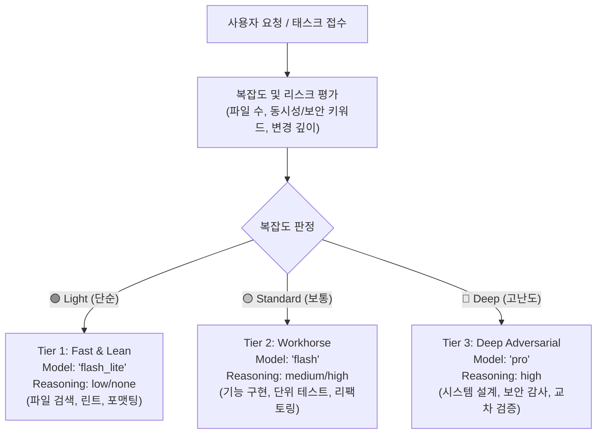

# Adaptive-Reasoning: Dynamic Thinking Budget & Tier Routing

Gemini 3.7 Flash의 하이브리드 추론(Thinking Budget: `low`/`medium`/`high`) 특성을 극대화하여, 단순 작업의 불필요한 대기 시간(TTFT)을 제거하고 복잡한 아키텍처/보안 작업에는 최고 강도의 추론 자원을 자동 배정하는 지능형 라우팅 가이드입니다.



---

## 3-Tier Dynamic Routing Protocol

### 🟢 Tier 1: Fast & Lean (`Model: "flash_lite"`)
* **대상 작업**: 파일 이름/심볼 검색, 마크다운 서식 정리, 린트/타입스크립트 단순 경고 수정
* **추론 강도**: Thinking 최소화 $\rightarrow$ 초고속 응답
* **호출 템플릿**:
```
invoke_subagent(
  Subagents=[
    {
      TypeName: "self",
      Role: "Lightweight Chore Worker",
      Model: "flash_lite",
      Prompt: "TASK: Format target file and fix formatting warnings.\nSCOPE: src/utils/format.ts\nVERIFY: check output syntax."
    }
  ],
  toolAction: "Running fast chore update",
  toolSummary: "Lightweight update"
)
```

---

### 🟡 Tier 2: Standard Workhorse (`Model: "flash"`)
* **대상 작업**: 핵심 비즈니스 로직 구현, 단위/통합 테스트 작성, AST 구조적 리팩토링, 코드베이스 서베이
* **추론 강도**: 1M 컨텍스트 + 하이브리드 CoT $\rightarrow$ 속도와 품질의 최적 균형
* **호출 템플릿**:
```
invoke_subagent(
  Subagents=[
    {
      TypeName: "self",
      Role: "Core Feature Implementer",
      Model: "flash",
      Prompt: "TASK: Implement user authentication service with JWT validation.\nDELIVERABLE: auth.service.ts and test/auth.test.ts.\nSCOPE: src/auth/\nVERIFY: npm test."
    }
  ],
  toolAction: "Implementing core feature with tests",
  toolSummary: "Standard feature development"
)
```

---

### 🔴 Tier 3: Deep Adversarial & Architecture (`Model: "pro"`)
* **대상 작업**: 분산 트랜잭션, 동시성/경쟁상태 분석, 보안 취약점 감사, 아키텍처 경계 검증, 듀얼 패스 교차 검증 오라클
* **추론 강도**: Deep Reasoning $\rightarrow$ 결함 제로 무결성 달성
* **호출 템플릿**:
```
invoke_subagent(
  Subagents=[
    {
      TypeName: "self",
      Role: "Adversarial Architecture Critic",
      Model: "pro",
      Prompt: "TASK: Conduct adversarial security and race-condition audit on payment gateway.\nDELIVERABLE: vulnerability report and exploit mitigation diff.\nSCOPE: src/payment/\nVERIFY: check against security compliance."
    }
  ],
  toolAction: "Executing deep adversarial audit",
  toolSummary: "Tier 3 deep verification"
)
```
