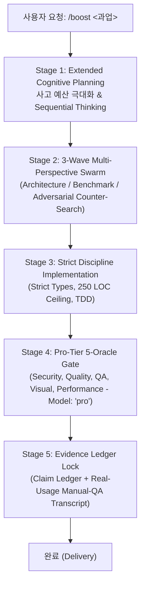

# Boost Mode: Deep Reasoning & Multi-Perspective Verification Engine

Google Antigravity의 **Boost Mode (`/boost`)**는 복잡한 시스템 아키텍처 설계, 대규모 리팩토링, 고난도 포렌식 역추적, 법률 쟁점 심층 분석 등 높은 인지 부하와 철저한 검증이 요구되는 고난도 작업을 위해 설계된 심층 오케스트레이션 파이프라인입니다.



## 5-Stage Boost Execution Contract

### Stage 1: Extended Cognitive Planning (심층 계획 및 사고 예산 극대화)
- **사고 예산 2배(2x Thinking Budget)** 할당 및 메타 인지 추론(`sequential-thinking` MCP) 활성화.
- 문제를 단순 1단계 질문으로 보지 않고, 3대 직교 축(아키텍처, 성능/신뢰성, 에지 케이스/반증)으로 선제 분해.
- 불확실성이 남은 경우 `ulw-plan` 인터뷰 게이트를 통해 사용자에게 필수 결정 사항만 정밀 질의.

### Stage 2: 3-Wave Multi-Perspective Swarm (다각도 병렬 탐색)
- `ultra-research` 기법을 적용하여 단일 턴에 3개 이상의 직교 관점 서브에이전트(`Model: "flash"`)를 병렬 스폰:
  1. **Spec & Architecture Scout**: 1차 소스(공식 문서, RFC, GitHub 소스) 탐색
  2. **Empirical & Benchmark Scout**: 실제 벤치마크, 프로덕션 사례, 성능 한계 조사
  3. **Adversarial & Counter Scout**: 취약점, CVE, 호환성 브레이킹 체인지, 커뮤니티 반론 조사

### Stage 3: Strict Discipline Implementation (엄격한 규율 구현)
- **Strict Typing**: `any` / `unwrap` / `panic` 금지, Parse-Don't-Validate 패턴 강제.
- **250 LOC Ceiling**: 단일 파일 250줄 초과 금지 (모듈 단위 즉시 분리).
- **TDD (Test-Driven Development)**: 실패하는 테스트를 먼저 작성하고 최소 변경으로 통과.

### Stage 4: Pro-Tier Oracle Gate (Pro 모델 전담 오라클 검증)
- 구현 완료 후, **모든 핵심 검증 오라클을 `Model: "pro"`로 상향**하여 병렬 실행:
  - 🛡️ **Security Oracle (Pro, Blocking)**: 주입 공격, 권한 경계, 경로 탈출 전수 검사
  - 🧠 **Code Quality Oracle (Pro, Blocking)**: 논리 오류, 타입 불변식, 회귀 결함 검사
  - 🕵️ **fact-mentor Adversarial Oracle (Pro, Blocking)**: 가짜 파일 경로, 버전 날조, 비공식 API 호출 및 허위 벤치마크 수치 전수 반증 감사
  - 🧪 **Hands-on QA Oracle (Pro, Blocking)**: 실제 런타임 실행 및 에지 케이스 결함 입증
  - 👁️ **Visual & CJK Oracle (Flash, Advisory)**: 한글 텍스트 클리핑 및 레이아웃 정합성 검사
  - ⚡ **Performance Oracle (Flash, Advisory)**: 메모리 누수 및 복잡도 병목 검사

### Stage 5: Evidence-Bound Delivery (기계적 증거 원장 잠금)
- "테스트 통과"에 안주하지 않고, **실제 런타임 수기 검증(Manual-QA Channel)** 트랜스크립트 증거 확보.
- 모든 주요 결론과 주장은 `claim-ledger.md`에서 2개 이상의 독립 도메인 검증 및 반증 검색 통과(`VERIFIED`) 확인.

---

## Boost Mode 트리거 및 사용법

```bash
# 1. 고난도 아키텍처 및 리팩토링 Boost 실행
/boost 전체 아키텍처 분석 후 멀티스레드 안정성 확보 리팩토링 진행

# 2. 심층 포렌식 역추적 Boost 실행
/boost 다중 메신저 및 시스템 아티팩트 교차 대조 타임라인 분석

# 3. 법률 쟁점 및 증거 무결성 Boost 실행
/boost 소장 청구취지 및 갑호증 입증방법 전수 판례 교차 검토
```
