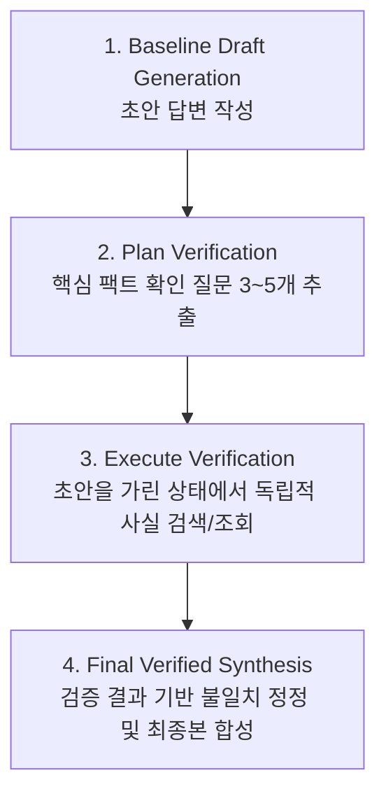

# Chain-of-Verification (CoVe): 4단계 검증 체인 스킬

**CoVe (Chain-of-Verification)**는 복잡한 다단계 추론, 역사/인물/기술 연표 질문에서 발생하는 모델의 자가 확증 편향(Confirmation Bias)을 타파하기 위해 설계된 4단계 사실성 교차 검증 스킬입니다.



## 4단계 실행 프로토콜

### Stage 1: 초안 작성 (Baseline Generation)
사용자의 복잡한 기술, 아키텍처, 또는 사실성 질의에 대해 1차 초안을 작성합니다.

### Stage 2: 검증 질문 계획 (Plan Verification)
초안에 포함된 구체적 수치, 버전, 날짜, 인과관계 중 사실 확인이 반드시 필요한 **3~5개의 독립 검증 질문**을 생성합니다.
- *원칙*: 질문은 이전 초안의 결론을 유도하지 않는 중립적 형태여야 합니다.
- *예시*: "X 라이브러리의 최신 안정 버전은 무엇인가?", "Y 함수가 멀티스레드 환경에서 데이터 레이스를 유발하는가?"

### Stage 3: 독립 검증 실행 (Execute Verification)
초안의 주장을 일시적으로 블라인드 처리하고, `research` MCP 도구(`web_search`, `fetch_json`) 또는 소스 파일 조회를 통해 각 질문에 대한 순수한 팩트를 독립 수집합니다.
- 초안이 "버전 2.0"이라고 주장했더라도, 검색 결과가 "버전 1.8"이면 검색 결과를 참으로 채택합니다.

### Stage 4: 최종 수정 합성 (Final Verified Output)
검증된 팩트와 초안을 대조하여, 오류나 과장된 부분을 수정한 **최종 검증 완료 답변**을 작성합니다.
- 수정된 항목이 있을 경우 답변 말미에 `CoVe Verification Corrections` 요약표를 첨부합니다.

## CLI 검증 스크립트

```bash
node scripts/cove_verify.mjs draft_response.md
```
