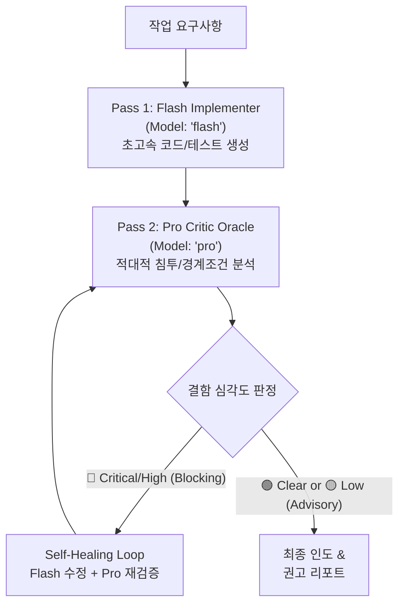

# Dual-Verify: 2-Pass Co-Verification & Self-Healing Pipeline

Gemini 3.7 Flash의 압도적인 코드 생성 속도와 Gemini Pro의 비판적(Adversarial) 심층 분석력을 결합하여, 버그와 보안 취약점을 사용자 인도 전에 100% 자체 치유하는 고도화 검증 파이프라인입니다.



---

## 2-Pass Pipeline Execution

### Pass 1: Flash Fast Implementation (초고속 생성)
`Model: "flash"`를 지정하여 요구사항에 맞춘 기능 코드 및 단위 테스트를 신속하게 작성합니다.

```
invoke_subagent(
  Subagents=[
    {
      TypeName: "self",
      Role: "Dual-Verify Implementer",
      Model: "flash",
      Prompt: """TASK: Implement the requested feature and comprehensive unit tests.
DELIVERABLE: complete code diff and passing test execution command.
SCOPE: target files in workspace.
VERIFY: parent executes tests and validates build."""
    }
  ],
  toolAction: "Generating implementation and unit tests",
  toolSummary: "Pass 1 fast implementation"
)
```

### Pass 2: Pro Adversarial Critic (적대적 오라클 검증)
`Model: "pro"`를 지정하여 생성된 코드의 보안, 동시성, 엣지 케이스, 경계 조건 침투 분석을 수행합니다.

```
invoke_subagent(
  Subagents=[
    {
      TypeName: "self",
      Role: "Adversarial Code Critic",
      Model: "pro",
      Prompt: """REVIEW TYPE: ADVERSARIAL CRITICAL AUDIT (Read-only)
GOAL: Find subtle race conditions, unhandled boundary values, memory leaks, and trust boundary bypasses.

ASSUME THE CODE HAS HIDDEN DEFECTS. Spot-check:
1. Concurrency & async re-entrancy / race hazards
2. Swallowed error boundaries and resource leaks
3. Injection vectors and improper input sanitization
4. Off-by-one / boundary edge-case handling

OUTPUT FORMAT:
VERDICT: CLEAR | DEFECT_FOUND
SEVERITY: CRITICAL | HIGH | MEDIUM | LOW
FINDINGS: concrete code evidence with file:line and exploit/failure scenario
REMEDIATION: exact replacement snippet"""
    }
  ],
  toolAction: "Conducting adversarial Pro oracle review",
  toolSummary: "Pass 2 critical audit"
)
```

---

## Tiered Blocking & Self-Healing Policy

1. **🔴 Critical / High Defect (BLOCKING)**:
   - 보안 취약점, 메모리 누수, 데이터 유실, 크래시를 유발하는 결함 발견 시 **즉시 자체 치유(Self-Healing) 루프**를 가동합니다.
   - Pro 오라클의 `REMEDIATION` 지침을 바탕으로 Flash 구현체가 코드를 수정하고, Pro 오라클이 `CLEAR`를 선언할 때까지 재검증합니다. (최대 3회 반복)
2. **🟡 Medium / Low Defect (ADVISORY)**:
   - 경미한 네이밍, 코드 스타일, 사소한 최적화 여지는 사용자 리포트에 권고 사항으로 명시하고 워크플로우를 차단하지 않습니다.
