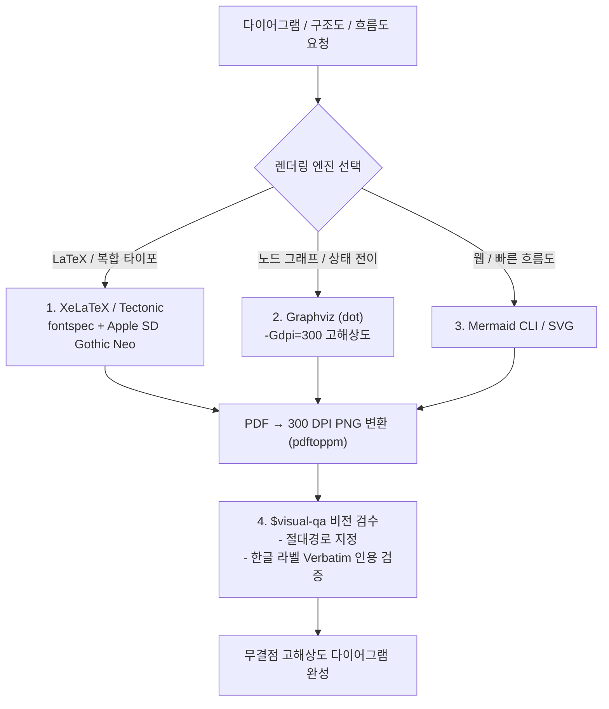
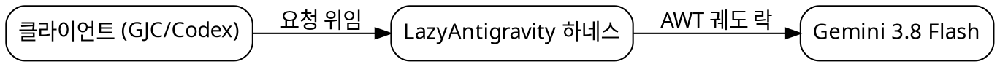

# Vector Diagram: Code-Based High-Precision Diagram Renderer

흐름도, 시스템 아키텍처 다이어그램, 프로세스 맵, 발표용 구조도를 제작할 때 **래스터 이미지 생성(`generate_image`) 사용을 엄격히 금지**하고, 코드로 고해상도 벡터(Vector) PNG/PDF를 직접 컴파일·렌더링하는 스킬입니다.

한글 자소 분리(깨짐) 현상과 흐릿한 텍스트를 원천 차단하며, **이미지 생성 용량 쿼터(429)를 전혀 소모하지 않습니다.**



---

## 3대 렌더링 엔진 & 레시피

### 1. XeLaTeX / Tectonic (고급 출판 및 한글 타이포 다이어그램)
macOS 및 리눅스 환경에서 한글 폰트(`Apple SD Gothic Neo` 또는 `Noto Sans CJK KR`)를 완벽하게 지원하는 Ti*k*Z / PGF 다이어그램을 생성합니다.

```latex
% diagram.tex
\documentclass[tikz,border=10pt]{standalone}
\usepackage{fontspec}
\setmainfont{Apple SD Gothic Neo} % macOS 기본 한글 (Linux: Noto Sans CJK KR)
\usetikzlibrary{shapes,arrows.meta,positioning}

\begin{document}
\begin{tikzpicture}[
    node distance=1.5cm,
    block/.style={rectangle, draw, fill=blue!10, text width=5em, text centered, rounded corners, minimum height=3em},
    line/.style={draw, -{Latex[length=3mm]}, thick}
]
    \node [block] (step1) {1. 수집 단계};
    \node [block, right=of step1] (step2) {2. 분석 단계};
    \node [block, right=of step2] (step3) {3. 검증 단계};
    \path [line] (step1) -- (step2);
    \path [line] (step2) -- (step3);
\end{tikzpicture}
\end{document}
```

```bash
# 컴파일 및 300 DPI 고해상도 PNG 래스터화
tectonic diagram.tex || xelatex diagram.tex
pdftoppm -png -r 300 diagram.pdf diagram_output
```

---

### 2. Graphviz (방대한 아키텍처 및 모듈 의존성 그래프)
노드와 엣지 관계를 직관적인 DOT 언어로 작성하고 300 DPI로 렌더링합니다.



```bash
dot -Tpng -Gdpi=300 arch.dot -o arch.png
```

---

### 3. Mermaid CLI / Python SVG
간단한 시퀀스 다이어그램이나 웹 연동 다이어그램은 `mmdc` 또는 Python `matplotlib`/`cairo`를 사용합니다.

```bash
mmdc -i sequence.mmd -o sequence.png -s 3 -b transparent
```

---

## 4대 품질 철칙

1. **`generate_image` 래스터 생성 절대 금지**: 다이어그램을 AI 확산 모델로 그리면 글자가 흐려지고 텍스트가 왜곡됩니다.
2. **시스템 미설치 도구 강제 설치 금지**: 머신에 이미 설치된 도구(`tectonic`, `xelatex`, `dot`, `python`)를 우선 탐색하여 사용합니다.
3. **한글 폰트 명시**: LaTeX 컴파일 시 반드시 `\usepackage{fontspec}` 및 `\setmainfont{Apple SD Gothic Neo}`를 선언합니다.
4. **산출물 이중 검증**: 생성된 PNG 파일에 대해 `file <output.png>` 및 `$visual-qa`를 통해 라벨 깨짐 여부를 검수합니다.
