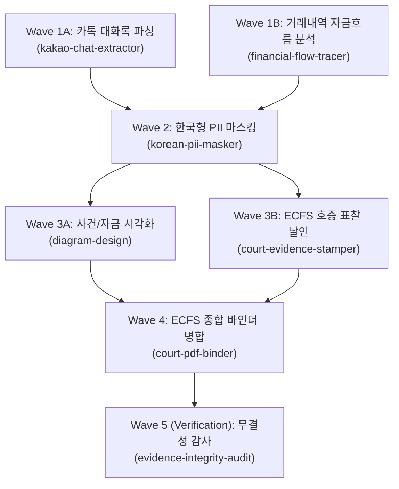

# Recipe: 포렌식 증거 패킷 자동 생성 파이프라인 (Forensic Evidence Packet)

사법기관(검찰·경찰) 및 법원(전자소송 ECFS) 제출을 위한 포렌식 증거 분석·가공·검증 표준 DAG 레시피입니다.

---

## 파이프라인 개요

- **입력**: 원시 증거 파일들 (카카오톡 내보내기 `.txt`, SQLite DB, 은행 거래내역 `.xlsx`/`.csv`)
- **출력**: 비식별화된 증거 파일, 호증 표찰 날인본, 사건 타임라인/자금흐름 다이어그램, Chain of Custody 무결성 증명서, 전자소송용 종합 PDF 바인더.

---

## 5-Wave 실행 명세

### Wave 1: 데이터 추출 및 구조화 (Parallel Quick)
- **Node `extract-chat`**:
  - `TASK`: 카카오톡 텍스트 내보내기 파일에서 대화록과 타임스탬프를 구조화 JSON/CSV로 추출한다.
  - `DELIVERABLE`: `.omo/mass-ulw/<key>/artifacts/chat_events.json`
  - `SCOPE`: 입력 텍스트 파일 읽기 전용.
  - `VERIFY`: 추출 건수 > 0 및 타임스탬프 파싱 유효성 확인.
  - `STOP WHEN`: JSON 파일 생성 완료.
- **Node `trace-finance`**:
  - `TASK`: 은행 거래내역에서 상대방별 입출금 흐름과 순환 거래 의심 내역을 추출한다.
  - `DELIVERABLE`: `.omo/mass-ulw/<key>/artifacts/flow_summary.json`
  - `SCOPE`: 거래내역 파일 읽기 전용.
  - `VERIFY`: 입출금 합계 대사 일치 확인.
  - `STOP WHEN`: flow_summary.json 생성 완료.

### Wave 2: 개인정보 비식별화 (Sequential Quick)
- **Node `mask-pii`**:
  - `TASK`: 1단계 산출물에서 주민번호, 계좌번호, 전화번호를 마스킹한다 (대륜 법인 정보는 보존).
  - `DELIVERABLE`: `.omo/mass-ulw/<key>/artifacts/masked/` 디렉터리 내 파일들.
  - `SCOPE`: `artifacts/*.json` 읽기, `artifacts/masked/` 쓰기.
  - `VERIFY`: 주민번호 정규식 매칭 건수 0건 확인.
  - `STOP WHEN`: 마스킹 산출물 및 마스킹 통계 생성 완료.

### Wave 3: 시각화 및 서증 표찰 (Parallel Quick)
- **Node `render-diagram`**:
  - `TASK`: `diagram-design`의 Sankey 또는 Timeline 템플릿을 활용해 자금 흐름도/사건 타임라인 HTML/SVG를 생성한다.
  - `DELIVERABLE`: `.omo/mass-ulw/<key>/artifacts/timeline_diagram.html`
  - `SCOPE`: 마스킹된 이벤트 JSON 읽기.
  - `VERIFY`: HTML 내 SVG 태그 및 렌더링 정상 여부 확인.
  - `STOP WHEN`: standalone 다이어그램 파일 생성 완료.
- **Node `stamp-evidence`**:
  - `TASK`: 마스킹된 증거 파일들에 갑 제1호증부터 순차적으로 호증 표찰을 날인한다.
  - `DELIVERABLE`: `.omo/mass-ulw/<key>/artifacts/stamped/` 내 표찰본.
  - `SCOPE`: 마스킹된 파일 읽기.
  - `VERIFY`: 각 파일 헤더에 호증 표찰 메타데이터 삽입 확인.
  - `STOP WHEN`: 전 파일 표찰 날인 완료.

### Wave 4: 종합 바인더 병합 (Quick)
- **Node `bind-pdf`**:
  - `TASK`: 표찰된 증거들과 다이어그램을 북마크 트리가 포함된 전자소송용 종합 PDF로 병합한다 (용량 초과 시 자동 분할).
  - `DELIVERABLE`: `.omo/mass-ulw/<key>/output/갑호증_종합증거바인더.pdf`
  - `SCOPE`: stamped 디렉터리 읽기.
  - `VERIFY`: PDF 페이지 수 일치 및 북마크 트리 탐색 확인.
  - `STOP WHEN`: 최종 PDF 생성 완료.

### Wave 5: 무결성 감사 및 CoC 증명 (Verification Wave - Pro)
- **Node `audit-integrity`**:
  - `TASK`: 원본 증거의 SHA-256과 최종 제출본의 매핑을 대조하고 Chain of Custody 무결성 증명서를 생성한다.
  - `DELIVERABLE`: `.omo/mass-ulw/<key>/output/무결성증명서.md` 및 JSON 원장.
  - `SCOPE`: 원본 및 산출물 전수 읽기.
  - `VERIFY`: 단 1건의 해시 불일치도 없음을 증명 (Exit code 0).
  - `STOP WHEN`: 무결성 증명서 서명란 날인 완료.
