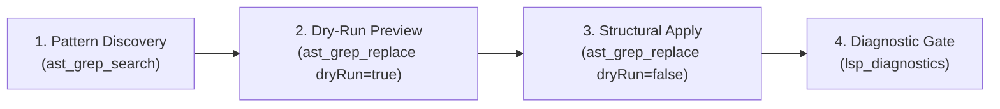

# AST-Refactor: Structural AST Pattern Refactoring

Gemini 3.8 Flash의 코드 구문 구조(AST) 이해력과 `ast-grep-mcp` 도구를 결합하여, 단순 텍스트 정규식 치환의 한계를 극복하고 안전한 대규모 구문 단위 리팩토링을 수행합니다.

## Antigravity Tool Mapping

| 작업 단계 | 실행 도구 / API |
| --- | --- |
| **AST 패턴 탐색** | MCP `ast_grep_search(pattern, lang, paths)` |
| **변경 시뮬레이션** | MCP `ast_grep_replace(pattern, rewrite, lang, dryRun=true)` |
| **원자적 AST 치환** | MCP `ast_grep_replace(pattern, rewrite, lang, dryRun=false)` |
| **타입 무결성 진단** | MCP `lsp_diagnostics(filePath)` 또는 `lsp_diagnostics_directory(directoryPath)` |
| **병렬 영향도 분석** | `invoke_subagent` (`Model: "flash"`) |

---

## 4-Step Structural Refactoring Workflow



### Step 1: Pattern Discovery (AST 검색)
정규식 대신 언어별 AST 메타변수(`$VAR`, `$$$ARGS`)를 사용하여 리팩토링 대상 패턴을 탐색합니다.

```typescript
// 예시: TypeScript Promise.then() 체이닝 탐색
ast_grep_search(
  pattern: "$PROMISE.then(($RES) => { $$$BODY })",
  lang: "typescript",
  paths: ["src/"]
)
```

### Step 2: Dry-Run & Diff Preview (사전 시뮬레이션)
반드시 `dryRun=true`를 설정하여 실제 파일 변경 전에 치환될 AST 노드와 diff를 검증합니다.

```typescript
ast_grep_replace(
  pattern: "$PROMISE.then(($RES) => { $$$BODY })",
  rewrite: "const $RES = await $PROMISE;\n$$$BODY",
  lang: "typescript",
  paths: ["src/"],
  dryRun: true
)
```

### Step 3: Atomic Structural Replacement (원자적 치환)
Dry-run 결과를 검증한 후 `dryRun=false`로 파일에 직접 반영합니다.

```typescript
ast_grep_replace(
  pattern: "$PROMISE.then(($RES) => { $$$BODY })",
  rewrite: "const $RES = await $PROMISE;\n$$$BODY",
  lang: "typescript",
  paths: ["src/"],
  dryRun: false
)
```

### Step 4: Diagnostic Gate (LSP 무결성 검증)
구조 치환 후 타입 에러나 린트 결함이 발생하지 않았는지 즉시 검증합니다.

```typescript
lsp_diagnostics(filePath: "src/services/user.ts")
```

---

## Subagent Dispatch Pattern

대규모 레포지토리에서 모듈별 리팩토링 영향도를 병렬 분석할 때는 Antigravity 표준 스키마를 사용합니다.

```
invoke_subagent(
  Subagents=[
    {
      TypeName: "self",
      Role: "AST Pattern Analyzer",
      Model: "flash",
      Prompt: """TASK: Analyze AST refactoring candidates for target pattern in scope.
DELIVERABLE: matched AST nodes, potential edge-cases, and variable scope conflicts.
SCOPE: repository read-only
VERIFY: parent verifies dryRun diff against cited files."""
    }
  ],
  toolAction: "Analyzing AST refactoring patterns",
  toolSummary: "AST pattern analysis"
)
```
