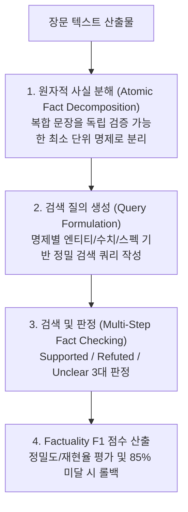

# SAFE: Search-Augmented Factuality Evaluator

Google DeepMind의 **SAFE (Search-Augmented Factuality Evaluator)** 방법론을 구현한 원자적 사실 분해 팩트체크 스킬입니다. 장문 기술 보고서, 벤치마크 분석, 코드 리뷰 산출물의 사실성을 초인적 수준(인간 평가자 대비 72%+ 일치도)으로 자동 검증합니다.



## 1. 4단계 SAFE 평가 파이프라인

### Stage 1: Atomic Fact Decomposition (원자적 사실 분해)
- 문장 하나에 여러 개의 주장이 섞여 있을 경우, 각각 독립적으로 참/거짓을 따질 수 있는 **단일 사실 명제(Atomic Fact)**로 쪼갭니다.
- 예시:
  - *복합 문장*: "React 19는 2024년에 출시되었으며 새로운 Server Actions와 컴파일러를 기본 내장한다."
  - *원자적 명제 1*: "React 19의 출시 연도는 2024년이다."
  - *원자적 명제 2*: "React 19에는 Server Actions가 포함되어 있다."
  - *원자적 명제 3*: "React 19에는 React Compiler가 기본 내장되어 있다."

### Stage 2: Query Formulation (검색 쿼리 생성)
- 각 원자적 명제에서 주관적 수식어를 제거하고, 1차 소스(공식 문서, RFC, GitHub, 논문)를 겨냥하는 검색 쿼리를 생성합니다.
- 한국어 질의의 경우 Cross-Lingual Pipeline을 거쳐 영문 기술 쿼리를 병행 생성합니다.

### Stage 3: Verification & Verdict (검증 및 판정)
- 검색 결과 및 참조 문서를 대조하여 다음 3가지 중 하나로 라벨링합니다:
  1. **Supported (지지됨)**: 1차 출처에서 명확한 증거가 발견됨.
  2. **Refuted (반증됨)**: 1차 출처의 사실과 명백히 모순되거나 날조됨.
  3. **Unclear (불확실)**: 증거가 부족하거나 상반된 정보가 존재함 (`[INSUFFICIENT_DATA]` 후보).

### Stage 4: Factuality F1 & Gate Enforcement (점수 산출)
- $\text{Precision} = \frac{\text{Supported}}{\text{Supported} + \text{Refuted}}$
- $\text{Factuality Score} = \frac{\text{Supported}}{\text{Total Atomic Facts}}$
- **Gate 기준**: Factuality Score가 **85% 미만**인 경우 완료(Stop)를 차단하고, 반증/불확실 명제를 수정한 뒤 재작성하도록 강제합니다.

## 2. CLI 실행 도구

LazyAntigravity에 내장된 `scripts/safe_evaluator.mjs`를 직접 구동할 수 있습니다:

```bash
# 기본 사실성 평가
node scripts/safe_evaluator.mjs report.md

# 1차 참조 문서를 대조군으로 제공하여 정밀 검증
node scripts/safe_evaluator.mjs report.md --kb verified_reference.txt

# 85% 미달 시 FAIL_CLOSED 차단
node scripts/safe_evaluator.mjs report.md --strict

# High-Fidelity 엄격 비파라메트릭 검증 (참조 KB 필수 대조 및 85%+ 무모순 게이트)
node scripts/safe_evaluator.mjs report.md --kb verified_reference.txt --high-fidelity

# High-Fidelity 비파라메트릭 각주 검증 병행 (Section 4.2)
node scripts/render_grounding_citations.mjs --file report_with_meta.json --high-fidelity
```
