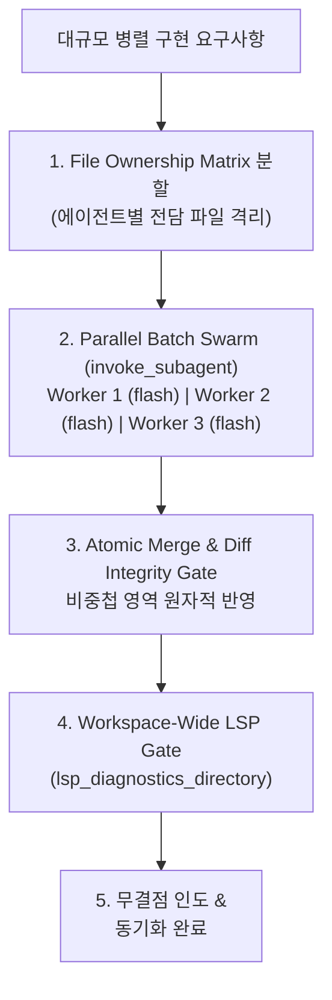

# Swarm-Sync: File Partitioning & Conflict-Free Swarm Orchestration

Gemini 3.7 Flash의 초저지연 병렬성을 극대화하여 여러 서브에이전트(3~8개)를 동시 가동할 때, **파일 수정 충돌(Race/Overwrite Conflict)**을 원천 차단하고 분산 작업의 결과물을 안전하게 원자적 머지(Atomic Merge)하는 오케스트레이션 스킬입니다.



---

## 4-Step Swarm-Sync Workflow

### Step 1: File Ownership Partitioning (파일 소유권 분할)
병렬 디스패치 전, 수정 대상 파일들을 서로 겹치지 않는(Disjoint) 배타적 영역으로 분할하여 각 서브에이전트의 `SCOPE`에 명시합니다.

| Worker | 역할 | 전담 파일 경로 (Ownership Scope) |
| --- | --- | --- |
| **Worker 1** | API & Controller | `src/controllers/`, `src/routes/` |
| **Worker 2** | Service & Business Logic | `src/services/`, `src/domain/` |
| **Worker 3** | Tests & Fixtures | `tests/unit/`, `tests/fixtures/` |

### Step 2: Parallel Batch Swarm Execution (병렬 배치 실행)
단일 `invoke_subagent` 턴에 소유권이 분할된 서브에이전트들을 동시 디스패치합니다.

```
invoke_subagent(
  Subagents=[
    {
      TypeName: "self",
      Role: "API Route Implementer",
      Model: "flash",
      Prompt: "TASK: Implement REST endpoints.\nSCOPE: src/controllers/user.controller.ts, src/routes/user.routes.ts\nRULE: Strictly respect ownership scope; do not touch services or tests."
    },
    {
      TypeName: "self",
      Role: "Domain Service Implementer",
      Model: "flash",
      Prompt: "TASK: Implement core business logic.\nSCOPE: src/services/user.service.ts, src/domain/user.entity.ts\nRULE: Strictly respect ownership scope; do not touch controllers or tests."
    },
    {
      TypeName: "self",
      Role: "Test Suite Implementer",
      Model: "flash",
      Prompt: "TASK: Implement comprehensive test coverage.\nSCOPE: tests/unit/user.service.test.ts\nRULE: Strictly respect ownership scope; do not touch source files."
    }
  ],
  toolAction: "Executing partitioned swarm workers",
  toolSummary: "Partitioned parallel swarm"
)
```

### Step 3: Atomic Merge & Conflict Verification (원자적 머지)
모든 서브에이전트 작업 완료 후 파일 수정 충돌 여부를 검사하고 일괄 머지를 수행합니다.

### Step 4: Whole-Workspace LSP Diagnostic Gate (전역 진단)
모든 변경 사항이 반영된 후 워크스페이스 전역 타입 진단을 실행하여 cross-file 타입 에러가 없음을 확인합니다.

```typescript
lsp_diagnostics_directory(directoryPath: "src/")
```
