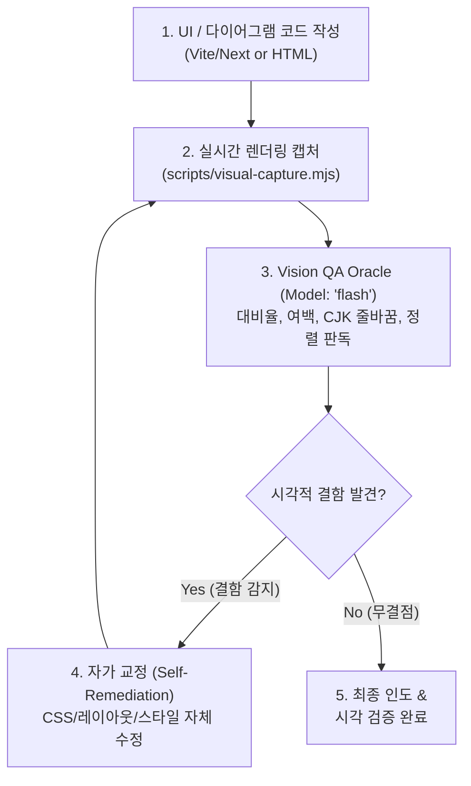

# UI-Loopback: Real-time Visual Inspection & Self-Remediation

Playwright Headless 캡처와 Gemini 3.7 Flash의 네이티브 멀티모달(Vision) 능력을 활용하여 코드 생성 직후 렌더링 화면을 즉각 검사하고, 시각적 결함(여백 불균형, CJK 글리프 잘림, 대비율 미달, SVG/Mermaid 다이어그램 정렬)을 사용자 인도 전에 100% 자가 교정하는 실시간 비전 피드백 루프입니다.



---

## 4-Step UI-Loopback Workflow

### Step 1: Render & Capture (실시간 렌더링 캡처)
작성된 컴포넌트나 로컬 개발 서버 URL을 캡처합니다:

```bash
# 로컬 개발 서버 URL 또는 HTML 파일 캡처
node ~/.gemini/config/plugins/lazyantigravity/scripts/visual-capture.mjs http://localhost:5173
```

### Step 2: Vision Inspection Oracle (비전 오라클 판독)
`Model: "flash"`를 사용하여 캡처된 스크린샷의 시각적 완성도를 판독합니다.

```
invoke_subagent(
  Subagents=[
    {
      TypeName: "self",
      Role: "Visual QA Oracle",
      Model: "flash",
      Prompt: """REVIEW TYPE: VISUAL INSPECTION & CJK FIDELITY (Multimodal)
GOAL: Inspect the rendered UI screenshot for visual bugs, alignment issues, and contrast defects.

CHECKLIST:
1. **Layout & Spacing**: Unbalanced padding/margin, horizontal overflow, flex/grid breakage.
2. **CJK & Typography**: Korean/CJK glyph clipping, unnatural line breaks, baseline drops.
3. **Color & Contrast**: WCAG AA color contrast ratios, dark mode readability.
4. **Diagram Precision**: SVG clipping, Mermaid node text overlap, arrow misalignments.

OUTPUT FORMAT:
VERDICT: PERFECT | REMEDIATION_REQUIRED
DEFECTS: list of specific visual flaws with location and severity
CSS_FIX: concrete CSS/code adjustments required"""
    }
  ],
  toolAction: "Inspecting rendered UI via native vision",
  toolSummary: "Visual UI loopback inspection"
)
```

### Step 3: Self-Remediation Loop (자가 교정)
`REMEDIATION_REQUIRED` 판정 시 제안된 CSS 및 마크업을 즉시 반영하고 재렌더링하여 재검증합니다. (최대 3회 자동 반복)

### Step 4: Quality Delivery (품질 보증 인도)
`PERFECT` 판정을 획득한 후 최종 코드를 사용자에게 인도합니다.
