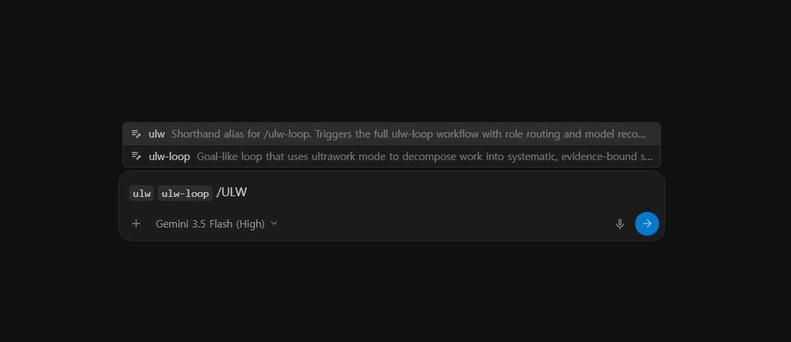
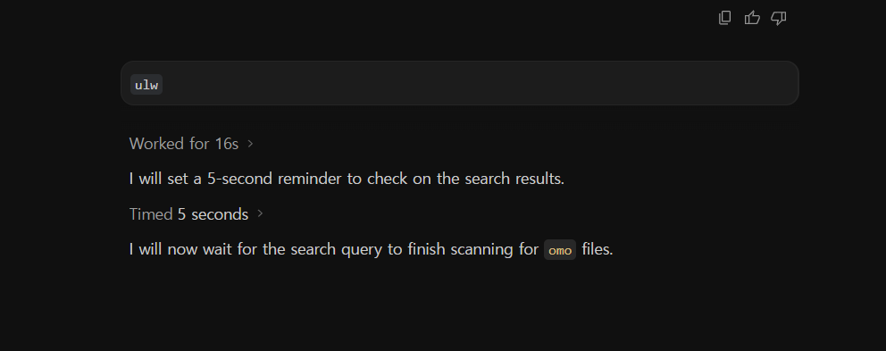
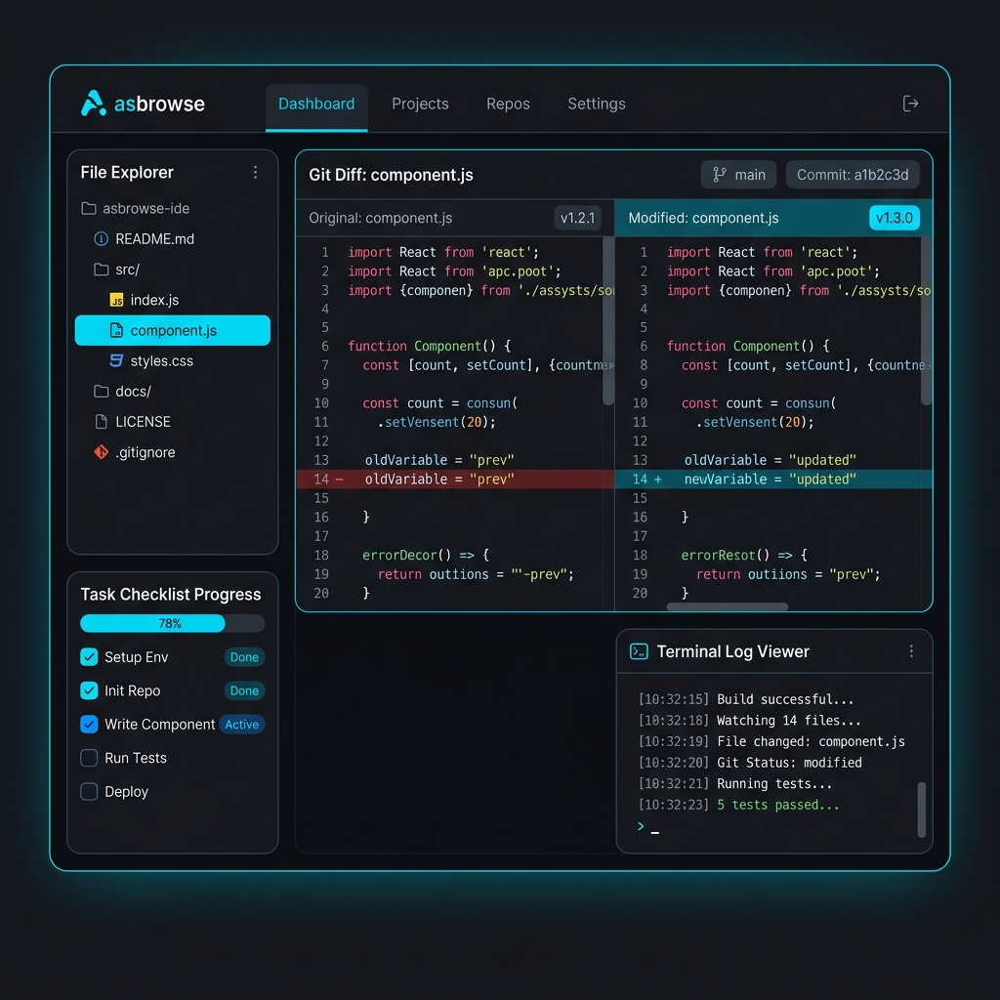
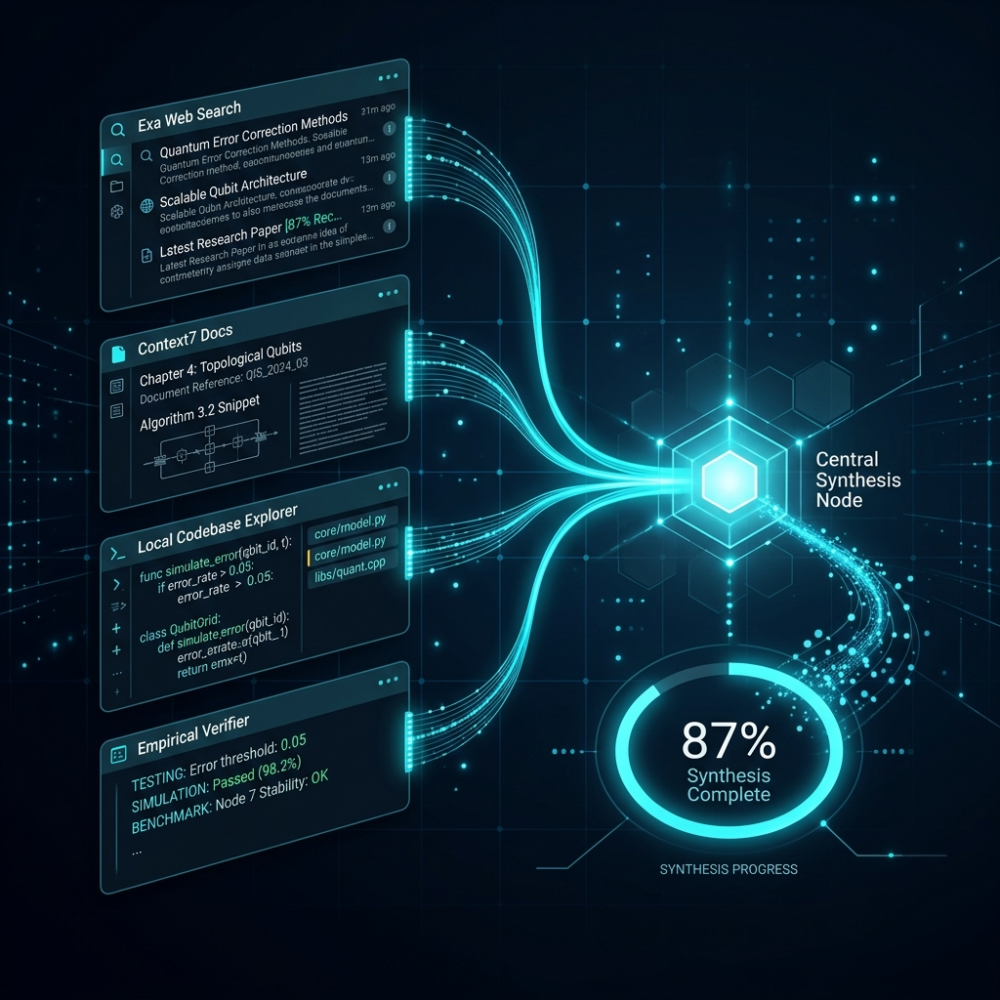
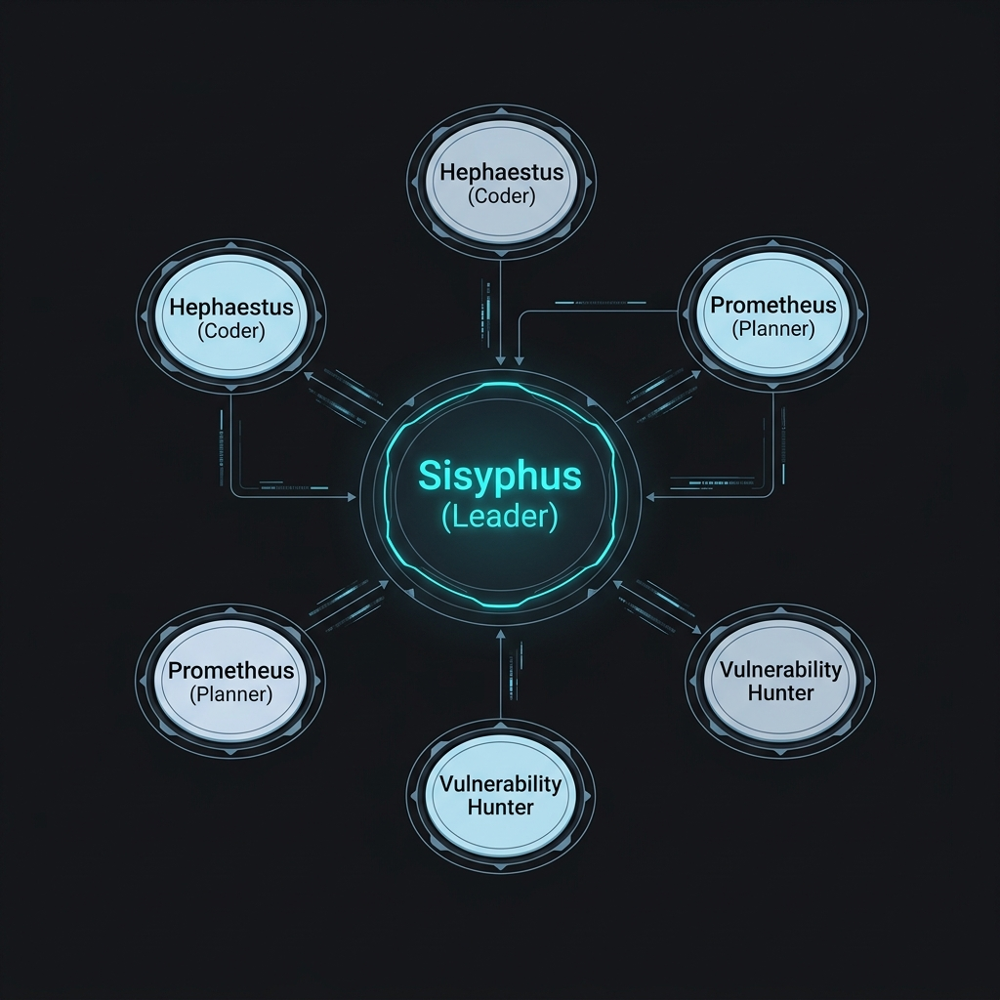
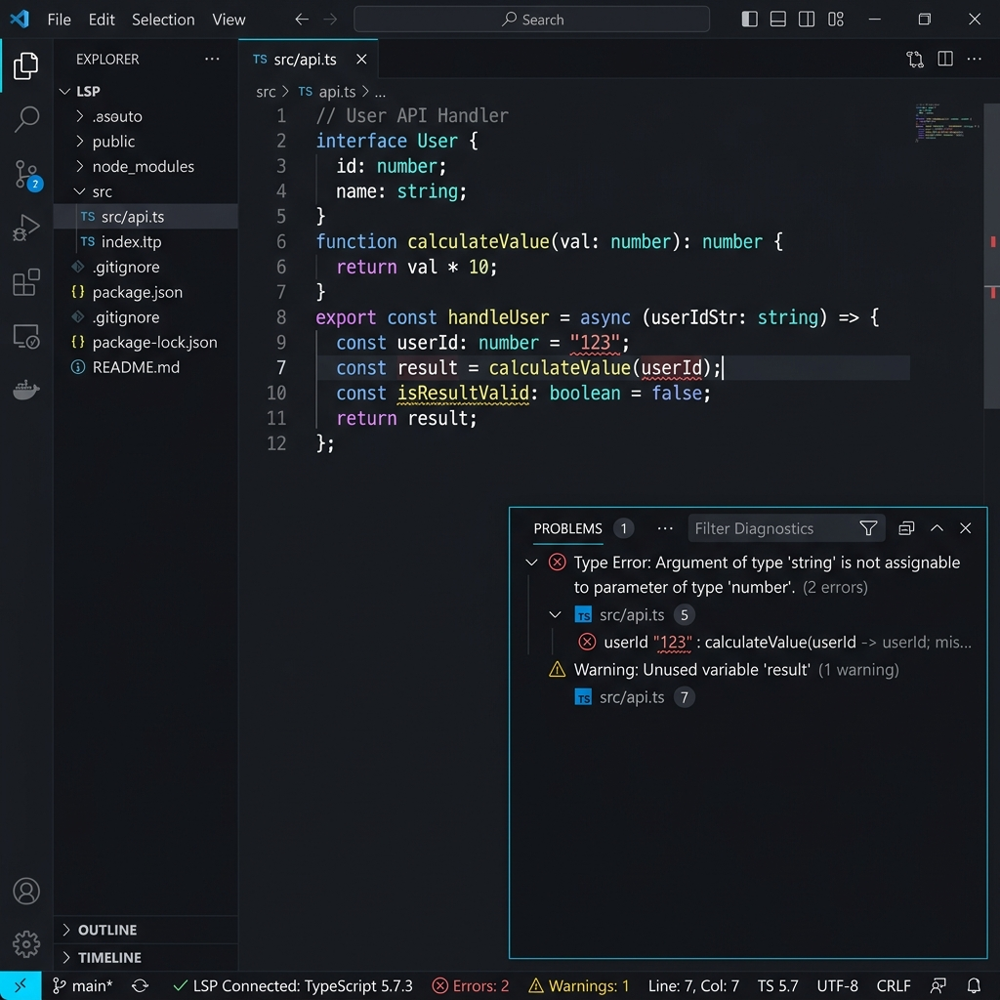
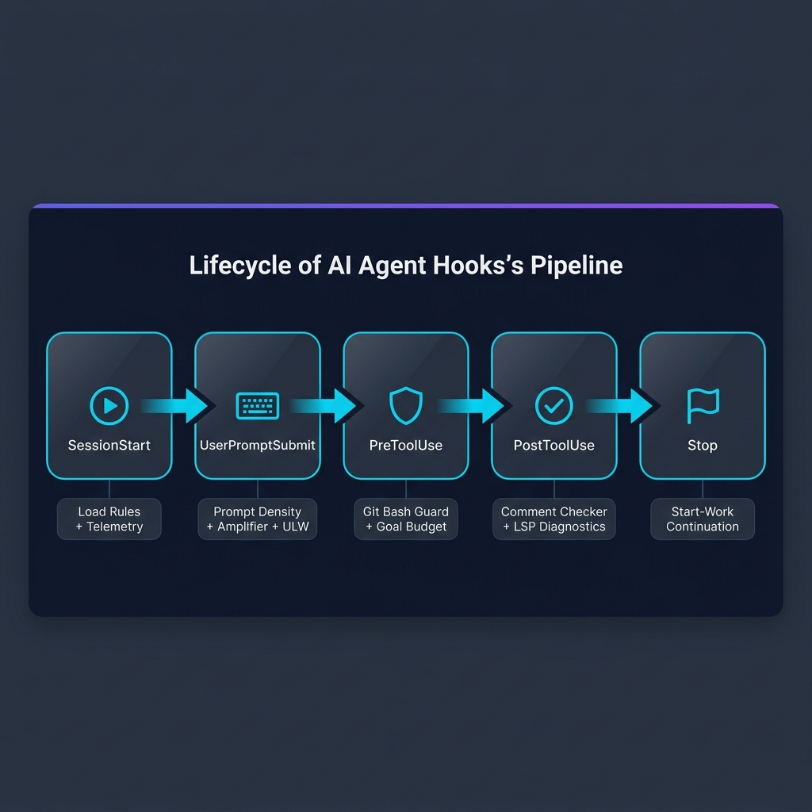
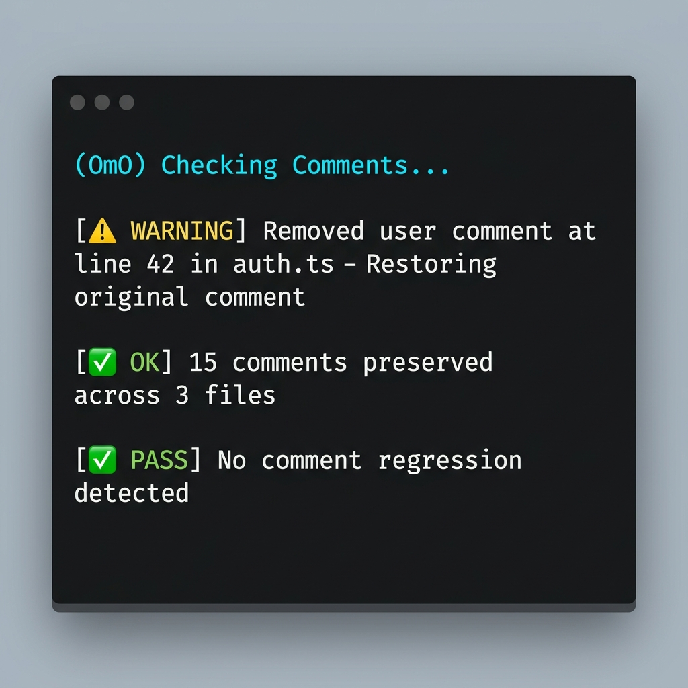
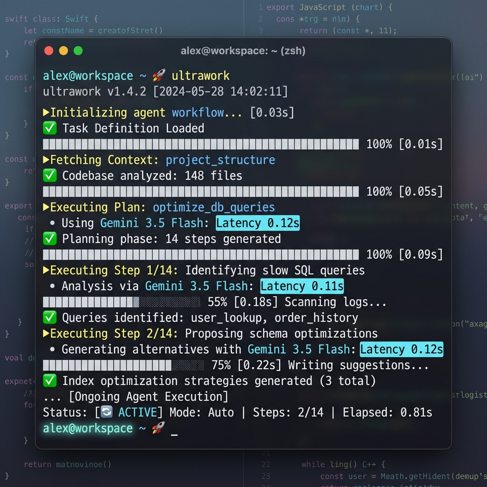

# 🌌 LAZYANTIGRAVITY — 한국어 상세 가이드

> *[Google Antigravity (Gemini CLI)](https://github.com/google-gemini/antigravity)에 최적화된 가장 기능이 풍부한 AI 에이전트 오케스트레이션 플러그인. 우로보로스(Ouroboros)와 lazycodex의 검증된 기반 위에 구축되었습니다.*
>
> *"제미나이도 좋은것들을 덕지덕지 붙이면 사용하기 좋지 않을까" 라는 생각으로 시작되었습니다.*

---

[](https://github.com/google-gemini/antigravity)
[](https://gemini.google.com)
[](https://github.com/google-gemini/antigravity)
[](https://github.com/code-yeongyu/lazycodex)
[](https://github.com/Q00/ouroboros)
[](../LICENSE.md)
[](https://github.com/daeryundf2-prog/LAZYANTIGRAVITY/stargazers)

**[🌐 English Guide →](./README.md)** &nbsp;|&nbsp; **[🏠 메인 README →](../README.md)**

---

## 목차

- [빠른 시작 & 설치](#-빠른-시작--설치)
- [지원 모델](#-지원-모델-supported-models)
- [핵심 명령어](#-핵심-명령어)
- [마법 키워드](#-마법-키워드-magic-keywords)
- [비주얼 대시보드: asbrowse](#-비주얼-대시보드-asbrowse)
- [전체 스킬 카탈로그 (29개)](#-전체-스킬-카탈로그-29개)
- [훅 파이프라인: 자동 품질 게이트](#-훅-파이프라인-자동-품질-게이트)
- [기술 아키텍처](#-기술-아키텍처)
- [유산과 철학](#-유산과-철학-ouroboros--lazycodex--lazyantigravity)
- [MCP 통합](#-mcp-통합)
- [텔레메트리 & 비활성화](#-텔레메트리--비활성화)

---

## ⚡ 빠른 시작 & 설치

> **전제 조건**: [Google Antigravity (Gemini CLI)](https://github.com/google-gemini/antigravity)가 설치되어 있어야 합니다.

### 1. 플러그인 클론 (Git Clone)

#### macOS, Linux, Git Bash
```bash
mkdir -p ~/.gemini/config/plugins
cd ~/.gemini/config/plugins
git clone https://github.com/daeryundf2-prog/LAZYANTIGRAVITY.git lazyantigravity
```

#### Windows PowerShell
```powershell
mkdir $env:USERPROFILE\.gemini\config\plugins -Force
cd $env:USERPROFILE\.gemini\config\plugins
git clone https://github.com/daeryundf2-prog/LAZYANTIGRAVITY.git lazyantigravity
```

### 방법 2: 패키지 매니저

```bash
# Ultimate 에디션 (OpenCode)
bunx oh-my-openagent install

# Light 에디션 (Codex CLI)
npx lazycodex-ai install
```

### 2. 세션 브라우저 기동

설치 또는 업데이트 후 Antigravity 에이전트를 재시작하고, **에이전트 세션 내부에서** 아래 명령어를 실행하십시오:
```
$browse
```
*(웹 서버 포트 3000이 활성화되어 있지 않으면 백그라운드로 Next.js 개발 서버를 자동 기동한 뒤 대시보드 브라우저 탭이 자동 팝업됩니다.)*

### 3. 웹 브라우징 (Ultimate Browsing) 환경 구성 (선택 사항)

Cloudflare WAF 우회 웹 크롤링, 웹 스크래핑, 또는 유튜브 자막 추출을 수행하는 **Ultimate Browsing / Insane Search** 스킬을 온전히 사용하려면 로컬 파이썬 가상환경 구성이 필요합니다.
아래처럼 플러그인 절대 경로(또는 폴더 내부로 이동하여)를 이용해 설치 스크립트를 기동하십시오.

```bash
# 방법 A: 절대 경로로 즉시 실행
node /Users/shinyoohag/.gemini/config/plugins/lazyantigravity/scripts/install-browsing-deps.mjs

# 방법 B: 플러그인 폴더로 이동 후 실행
cd ~/.gemini/config/plugins/lazyantigravity && node scripts/install-browsing-deps.mjs
```
*(이 명령은 `.omo/ulw-loop/browsing-venv` 가상환경을 잡고 `curl_cffi`, `playwright`, `yt-dlp` 및 Playwright Chromium 드라이버 브라우저 바이너리를 자동 다운로드/세팅합니다.)*

---

## 🤖 지원 모델 (Supported Models)

lazyantigravity는 **Antigravity가 제공하는 모든 모델**에서 동작합니다. Gemini 3.5 Flash에 최적화되어 있지만, 작업의 복잡도에 따라 다른 모델도 자유롭게 사용할 수 있습니다.

| 모델 | 추천 사용 상황 |
| :--- | :--- |
| **Gemini 3.5 Flash** (High/Medium) | 빠른 반복 작업, 디버깅, 코드베이스 탐색 — 기본 추천 모델 |
| **Gemini 3.1 Pro** (High) | Claude 쿼터가 제한적일 때의 고품질 대안 |
| **Claude Opus 4.6** (Thinking) | 아키텍처 설계, 복잡한 리팩토링, 깊은 분석 |
| **Claude Sonnet** | 일반적인 구현 작업 |

> 💡 **ULW Model Routing**: `ulw` / `ulw-loop` 실행 시, 각 역할(planner, worker, verifier)에 최적의 모델을 자동으로 추천합니다. 사용자가 현재 선택한 모델이 모든 서브에이전트에 상속됩니다.

## 🎮 핵심 명령어

> [!IMPORTANT]
> **핵심 권장 사항 (Just use `ulw`!)**
> - **다른 복잡한 스킬들은 몰라도, 그냥 `ulw` (또는 `ultrawork`) 하나만 입력해서 사용하면 됩니다!** 이 스킬이 코드를 알아서 분석/수정하고 테스트를 수행하여 100% 검증될 때까지 자동으로 루프를 수행하는 핵심 코딩 엔진입니다.
> - **`ulw`와 `ralph`는 어떻게 다른가요?**
>   - **`ulw` (실행 엔진)**: 실제로 파일을 생성/수정하고 테스트 코드를 돌리며 기능을 구현하는 **주요 동력**입니다.
>   - **`ralph` (안전 장치 / 복원 루프)**: 오랜 작업 중 API 호출 한도 초과나 세션 끊김으로 에이전트가 멈추었을 때, **기존의 에이전트 상태를 ledger(로그)로부터 복구하여 멈춘 자리에서부터 안전하게 작업을 이어가도록 보장하는 영속성 장치**입니다.

에이전트 터미널에서 직접 입력하거나 프롬프트에 포함할 수 있는 명령어입니다:

| 명령어 | 설명 | 핵심 이점 |
| :--- | :--- | :--- |
| **`ultrawork`** / **`ulw`** | 최강의 자율 코딩 루프. 코드 작성 → 테스트 실행 → 수정을 반복하며 100% 검증될 때까지 지속. | Gemini 3.5 Flash의 초고속 반복을 최대한 활용 |
| **`ultraresearch`** / **`research`** | 최대 포화 리서치 오케스트레이터. 코드베이스, 웹 문서, 저장소를 스캔하고 발견된 코드를 샌드박스에서 검증. | 출처가 명시된 증거 기반 리서치 보고서 생성 |
| **`browse`** / **`$browse`** | **asbrowse** 세션 브라우저 대시보드 오픈 (참고: `asbrowse`는 대시보드 이름이며, 실행하는 명령어는 `browse` 또는 `$browse`입니다). | 포트 3000의 Next.js 서버를 미기동 시 자동 부팅 |
| **`/ulw-loop`** | 증거 감사 기반 멀티 골 오케스트레이션 루프. | 대형 피처의 감사 가능한 신뢰성 보장 |
| **`/init-deep`** | 프로젝트 전역에 계층형 `AGENTS.md` 컨텍스트 파일 자동 생성. | 에이전트 도메인 인식 극대화 및 토큰 효율 향상 |
| **`/start-work`** | Prometheus 플래너: 인터뷰 → 계획 수립 → 코드 수정 전 모호성 해소. | 요구사항 갭과 리스크를 코딩 전에 원천 차단 |

### ULW 실행 화면

<div align="center">
  
  <br /><em>명령어 팔레트에서 ULW 스킬 선택</em>
</div>

<br />

<div align="center">
  
  <br /><em>ULW 루프 실행 중 — 스캔, 계획, 자율 반복 수행</em>
</div>

---

## 🪄 마법 키워드 (Magic Keywords)

프롬프트에 아래 단어를 포함하기만 하면 시스템이 자동 감지하여 해당 스킬을 트리거합니다. 별도 설정 불필요.

| 키워드 | 트리거 스킬 | 동작 |
| :--- | :--- | :--- |
| `ralph`, `don't stop`, `must complete`, `keep going` | `$ralph` | 자기참조 영속 루프 — 모든 태스크가 검증될 때까지 지속 |
| `autopilot`, `build me`, `I want a` | `$autopilot` | 아이디어 → 작동 코드까지의 완전 자율 파이프라인 |
| `team`, `swarm`, `coordinated team` | `$team` | 복잡한 병렬 작업을 위한 협업 에이전트 팀 생성 |
| `tdd`, `test first` | `$tdd` | 테스트 주도 개발 — 구현 전 테스트 코드부터 작성 강제 |
| `fix build`, `type errors` | `$build-fix` | 빌드 에러 및 TypeScript 타입 실패 타겟 해결 |
| `review code` | `$code-review` | 종합 정적 분석 및 코드 품질 리뷰 |
| `frontend`, `design`, `UI`, `UX` | `$frontend` + `$visual-qa` | Playwright 시각 QA, Lighthouse 100점 오딧, React 프로파일링 |
| `refactor`, `cleanup`, `restructure` | `$refactor` | 안전 검증을 포함한 지능형 코드 리팩토링 |
| `research`, `deep research` | `$ultraresearch` | 출처 명시 합성을 포함한 최대 포화 병렬 리서치 |
| `remove slop`, `deslop`, `clean AI code` | `$remove-ai-slops` | AI 생성 코드 악취 10개 카테고리 제거 |
| `spec interview`, `grill me` | `$spec-interview` | 소크라테스식 Q&A → 요구사항 보고서 |
| `debug this`, `why is X not working` | `$debugging` | 가설 기반 디버깅 루프 + Oracle 스폰 |
| `visual QA`, `screenshot diff` | `$visual-qa` | UI 회귀를 위한 픽셀 디프 분석 |

---

## 🖥️ 비주얼 대시보드: asbrowse

asbrowse 대시보드는 터미널 로그 과부하를 구조화된 실시간 웹 인터페이스로 대체합니다.

<div align="center">
  
  <br /><em>asbrowse Command Center — 실시간 진행률, 코드 Diff, 로그, 시각 QA를 한 화면에서</em>
</div>

<br />

### 주요 기능

- **그리드 기반 정보 구조**: 워크플로우 진행률, 활성 단계(Prometheus 계획), 코드 Diff, 터미널 로그, Playwright 시각 QA 뷰포트를 깔끔한 패널로 분리.
- **프리미엄 다크 + 시안 미학**: `DESIGN.md` 명세를 따라 제작. HSL 다크 그레이 그라데이션, 시안(#00d4ff) 악센트, Geist 타이포그래피, 매끄러운 마이크로 애니메이션.
- **자동 부팅 & 제로 설정**: `$browse` 호출 시 포트 3000 감지 → Next.js 서버 백그라운드 기동 → 시스템 브라우저 자동 오픈. 수동 설정 불필요.
- **보안 로컬 전용**: localhost에서만 실행. 어떤 데이터도 외부로 전송되지 않음.

---

## 📦 전체 스킬 카탈로그 (29개)

모든 스킬은 마법 키워드로 자동 트리거되거나 `$name` / `/name`으로 수동 호출됩니다.

> 💡 **작동 원리**:
> - **워크플로우 엔진 (6개)**: 전체 자율 코딩 루프와 에이전트 조율을 주도하는 **뇌(Brain)** 역할을 합니다.
> - **전문화된 스킬 (20개)**: 코딩 루프 실행 중 코드를 수정하거나 검증할 때 백그라운드 훅(Lifecycle Hooks)으로 자동 연동되거나 필요에 따라 엔진에 의해 호출(Call)되는 **도구 및 품질 게이트** 역할을 합니다.

###  워크플로우 엔진 (6개)

| 스킬 | 트리거 | 설명 |
| :--- | :--- | :--- |
| **ultrawork / ulw** | `ultrawork`, `ulw`, `parallel` | 자율 검증 루프를 갖춘 최대 병렬성 |
| **ulw-loop** | `/ulw-loop` | 체크포인트를 갖춘 증거 감사 멀티 골 루프 |
| **ulw-plan** | `/ulw-plan` | ulw-loop 세션의 계획 단계 |
| **start-work** | `start work`, `execute plan`, `resume plan` | 상태 추적을 포함한 Prometheus 작업 계획 실행 |
| **ralph** | `ralph`, `don't stop`, `keep going` | 자기참조 영속 루프 (우로보로스에서 상속) |
| **autopilot** | `autopilot`, `build me` | 아이디어 → 작동 코드 자율 파이프라인 |

###  리서치 (1개)

| 스킬 | 트리거 | 설명 |
| :--- | :--- | :--- |
| **ultraresearch** | `research`, `deep research`, `ultraresearch` | 병렬 스웜: Exa 웹검색 + Context7 문서 + 로컬 코드베이스 + 실증 검증 → 출처 명시 합성 보고서 |

<div align="center">
  
  <br /><em>Ultraresearch 병렬 스웜 — 4가지 소스에서 동시에 지식을 합성</em>
</div>

###  팀 & 오케스트레이션 (1개)

| 스킬 | 트리거 | 설명 |
| :--- | :--- | :--- |
| **teammode** | `team`, `swarm`, `make a team` | 리드 에이전트 + 최대 8명의 병렬 멤버. tmux 그리드 시각화. 내장 팩: `hyperplan`, `security-research` |

<div align="center">
  
  <br /><em>멀티 에이전트 팀 스웜 — tmux 모니터링과 병렬 협업</em>
</div>

###  코드 품질 (5개)

| 스킬 | 트리거 | 설명 |
| :--- | :--- | :--- |
| **programming** | `.py`, `.ts`, `.tsx`, `.rs`, `.go` 파일 작업 | 엄격한 타입, 모던 스택 (Pydantic v2 / serde / Zod / gin), 250 LOC 상한, TDD |
| **refactor** | `refactor`, `cleanup`, `restructure` | 안전 검증을 포함한 지능형 다단계 리팩토링 |
| **remove-ai-slops** | `remove slop`, `deslop`, `clean AI code` | AI 코드 악취 10개 카테고리 제거, 250+ LOC 분할 강제 |
| **review-work** | `review work`, `check my work` | 5개 병렬 리뷰 에이전트: 목표 검증, 코드 품질, 보안, QA, 컨텍스트 마이닝 |
| **comment-checker** | 자동 (PostToolUse 훅) | AI가 편집 중 사용자 주석을 조용히 삭제하는 것 방지 |

###  코드 인텔리전스 (3개)

| 스킬 | 트리거 | 설명 |
| :--- | :--- | :--- |
| **lsp** | 자동 (PostToolUse 훅) | `lsp_diagnostics`, `lsp_find_references`, `lsp_rename`, `lsp_hover` — IDE급 분석 |
| **lsp-setup** | `lsp setup`, `configure LSP` | 21개 언어에 대한 언어 서버 설정 — 설치 명령어 및 config 스니펫 포함 |
| **ast-grep** | 구조적 코드 검색 작업 | 25개 언어에서 AST 수준 코드 패턴 매칭 및 결정론적 코드모드 |

<div align="center">
  
  <br /><em>실시간 LSP 진단 — 타입 에러와 경고를 즉시 포착</em>
</div>

###  프론트엔드 & 디자인 (3개)

| 스킬 | 트리거 | 설명 |
| :--- | :--- | :--- |
| **frontend** | `frontend`, `UI`, `UX`, `design` | 12개 테이스트 스킬 + 69개 브랜드 디자인 레퍼런스의 안티슬롭 테이스트 라우터. React 개발 도구: react-scan, react-doctor. Playwright Chromium 오딧으로 Lighthouse 100 |
| **visual-qa** | `visual QA`, `screenshot diff`, `UI looks wrong` | 픽셀 디프 분석 + CJK 텍스트 정밀도 + 디자인 시스템 및 기능 무결성을 위한 2개 병렬 Oracle 패스 |
| **clone** | `clone`, `clone website` | 대상 웹사이트 URL을 리버스 엔지니어링하여 Next.js/Tailwind v4/shadcn UI React 프로젝트로 복제 및 구축 |

###  디버깅 (1개)

| 스킬 | 트리거 | 설명 |
| :--- | :--- | :--- |
| **debugging** | `debug this`, `why is X not working`, `trace this bug` | 가설 기반 루프: 3개 이상의 가설 수립 → 병렬 조사 → 2회 실패 후 직교 각도에서 Oracle 스폰 → 근본 원인 확인 → 실패 테스트로 고정 → 최소 수정 |

###  웹 & 브라우징 (2개)

| 스킬 | 트리거 | 설명 |
| :--- | :--- | :--- |
| **browse** | `$browse`, `browse` | asbrowse 대시보드 오픈, Next.js 서버 자동 부팅 |
| **ultimate-browsing** | `blocked site`, `bypass bot detection`, `stealth browser` | 계층형 WAF 우회: curl_cffi TLS 위장 → 플랫폼 리더 (샤오홍슈, 더우인 등) → CloakBrowser 스텔스 Chromium |

###  Git (1개)

| 스킬 | 트리거 | 설명 |
| :--- | :--- | :--- |
| **git-master** | 커밋/히스토리 작업 | 아토믹 커밋, 스테이징, 리베이스, 스쿼시, fixup/autosquash, blame, bisect, reflog, git log -S/-G |

###  제품 & 명세 (1개)

| 스킬 | 트리거 | 설명 |
| :--- | :--- | :--- |
| **spec-interview** | `spec interview`, `grill me` | 소크라테스식 Q&A → 모호성 점수 → 정제된 요구사항 보고서 (pm.md) + 슬라이드 개요 |

###  설정 & 구성 (4개)

| 스킬 | 트리거 | 설명 |
| :--- | :--- | :--- |
| **init-deep** | `/init-deep` | 프로젝트 디렉토리 전역에 계층형 `AGENTS.md` 지식 베이스 생성 |
| **rules** | 규칙 관련 질문 | Codex 규칙 동작, 규칙 파일 위치, 매칭, 환경 설정 설명 |
| **sync-rules** | `sync-rules`, `sync rules` | 마스터 AGENTS.md 규칙 파일을 각 플랫폼별(Cursor, Claude Code, Gemini CLI 등) 설정 파일에 조건부 빌드 및 자동 동기화 (--watch 지원) |
| **skill-gen** | `skill-gen` | 반복되는 작업 패턴이나 사용자 명세를 기반으로 프로젝트 내 커스텀 스킬(.agents/skills/)을 동적 설계 및 자동 등록 |

###  플러그인 건강 관리 (3개)

| 스킬 | 트리거 | 설명 |
| :--- | :--- | :--- |
| **lcx-doctor** | `doctor`, 건강 검사 | 최신 소스 대비 lazycodex/플러그인 설치 상태 진단 |
| **lcx-report-bug** | `report bug`, `file bug` | 소스 기반 근본 원인과 재현 단계를 포함한 고품질 버그 이슈 생성 |
| **lcx-contribute-bug-fix** | `fix bug`, `contribute bug fix` | lazycodex/Codex 버그에 대한 검증된 수정 이슈 또는 포크 PR 오픈 |

---

## 🔧 훅 파이프라인: 자동 품질 게이트

lazyantigravity는 **7개 라이프사이클 이벤트**에서 **13개 훅**을 실행합니다. 에이전트의 모든 행동이 자동으로 보호됩니다.

<div align="center">
  
  <br /><em>전체 훅 라이프사이클 — 세션 시작부터 에이전트 정지까지</em>
</div>

<br />

### 라이프사이클 이벤트

| 이벤트 | 훅 | 목적 |
| :--- | :--- | :--- |
| **SessionStart** | 프로젝트 규칙 로더, 텔레메트리 레코더, 자동 업데이트 체커 | 규칙, 메트릭, 최신 코드로 에이전트 환경 초기화 |
| **UserPromptSubmit** | 프롬프트 밀도 분석기, 프롬프트 앰플리파이어, 규칙 리로더, Ultrawork 트리거, ULW-Loop 스티어링 | 모델이 처리하기 전에 모든 프롬프트를 최적화 |
| **PreToolUse** | Git Bash MCP 추천기, ULW-Loop 골 버짓 강제기 | 스마트 추천과 버짓 한도로 도구 실행 보호 |
| **PostToolUse** | Comment Checker, LSP 진단, 프로젝트 규칙 매처 | 모든 파일 편집에 대해 주석 보존, 타입 정확성, 규칙 준수 검증 |
| **PostCompact** | Git Bash 캐시 리셋, 규칙 캐시 리셋, LSP 캐시 리셋 | 컨텍스트 윈도우 압축 후 캐시 정리 |
| **Stop** | Start-Work 연속 체크 | 에이전트 중지 전 남은 계획 작업 확인 |
| **SubagentStop** | Start-Work 연속 체크 | 자식 에이전트에 대한 동일 체크 |

### Comment Checker (PostToolUse)

lazyantigravity의 가장 특징적인 기능 중 하나입니다. AI 에이전트는 코드 편집 시 사용자의 주석을 경고 없이 삭제하는 경우가 빈번합니다. Comment Checker가 이를 실시간으로 포착합니다:

<div align="center">
  
  <br /><em>Comment Checker가 삭제된 주석을 감지하고 에이전트에게 경고</em>
</div>

### 프롬프트 앰플리파이어 (UserPromptSubmit)

모델이 프롬프트를 보기 전에 프롬프트 앰플리파이어가 분석하고 강화합니다:
- 더 엄격한 준수를 위한 제약 조건 주입
- 프롬프트가 너무 모호할 때 경고하는 밀도 점수화
- 프로젝트 규칙에서 자동 컨텍스트 확장

---

## 🛠️ 기술 아키텍처

### Gemini 3.5 Flash 최적화

<div align="center">
  
  <br /><em>lazyantigravity 터미널 실행 — Gemini 3.5 Flash 속도에 최적화</em>
</div>

<br />

lazyantigravity는 **Gemini 3.5 Flash**를 위해 목적 설계되었습니다:

- **서브 세컨드 추론 활용**: Flash의 빠른 응답 사이클에서 처리량을 최대화하도록 프롬프트 계층 구조를 설계.
- **스마트 쿼터 제어**: 실시간 API 소비 모니터링으로 워크플로우 중단 없이 비용 효율성 보존.
- **Compact Mode**: 중복 터미널 로그를 필터링하고 핵심 코드 스니펫으로 압축, 토큰 예산을 동적 최적화.
- **Safe-Resume 체크포인트**: 상태를 `.lazycodex/checkpoints/ulw-*.json`에 동결. `omo ulw-loop resume`으로 중단 지점에서 정확히 재개.

### Hash-Anchored Edits (Hashline)

"Harness Problem" — AI 에이전트가 낡은 라인 번호를 참조하여 코드를 오염시키는 현상 — 을 해결합니다:

1. 에이전트가 파일을 읽을 때 모든 줄에 고유 콘텐츠 해시(`LINE#ID`)가 부여됩니다.
2. 에이전트는 편집 시 이 해시를 타겟으로 사용합니다.
3. 파일이 동시에 변경되었거나 (다른 프로세스가 수정, 또는 에이전트가 잘못된 콘텐츠 참조) 편집이 **안전하게 거부**됩니다.
4. 결과: 코드 오염율 거의 0%.

### 신뢰성 & 환각 제어 (Reliability & Hallucination Mitigation)

Gemini 3.5 Flash는 탁월한 속도를 자랑하지만, 에이전트의 환각(존재하지 않는 API 스펙 조작, 코드 편집 시 주석 강제 삭제, 빌드 깨짐 등)은 코딩 품질을 무너뜨리는 큰 원인입니다. `lazyantigravity`는 이를 5가지 기술적 레이어로 제어합니다:

1. **증거 기반 실행 루프 (`ulw`)**: 테스트 패스, 빌드 완료, 정상 응답 코드 등 **실질적인 실행 증거**가 수집되어 검증을 통과해야만 완료를 승인합니다. 환각 코드가 유입되면 즉각 컴파일/테스트 에러로 감지되어 모델이 스스로 자가 수정(Self-Correction)하도록 강제합니다.
2. **LSP 정적 분석 품질 게이트**: 코드가 수정되는 즉시 백그라운드에서 정적 검사(TypeScript의 `tsc --noEmit` 등)를 수행하여 존재하지 않는 컴파일 수준의 환각(타입 에러, 부적절한 메소드 호출 등)을 실시간으로 차단합니다.
3. **주석 검사기 (Comment Checker)**: LLM이 코드를 다듬으면서 의도치 않게 주석이나 docstring을 무단 삭제하는 편집 환각 현상을 모니터링하여 경고를 보냅니다.
4. **해시 기반 수정(Hashline)**: 라인 번호 대신 고유한 콘텐츠 해시를 기준으로 타겟팅하여 라인이 다소 밀리거나 누락되더라도 코드가 꼬여 파일이 오염되는 환각 현상을 제거합니다.
### 제미나이 3.5 & 3.1 Pro 아키텍처 최적화 (/ulw 연동)

제미나이 3.5 Flash 및 3.1 Pro 모델의 네이티브 아키텍처적 특성을 100% 활용하여 응답 정확도를 극대화하고 품질 저하 없이 사용 속도를 개선하기 위한 전용 최적화가 적용되었습니다:

1. **System Instruction Envelope (시스템 지침 봉투화)**
   - **특성**: 일반 대화 본문에 지침을 섞어 보낼 경우, 2M 토큰에 달하는 컨텍스트 창 속에서 지침이 점차 묻히는 경향(지침 표류)이 매우 강합니다. 제미나이는 API 수준의 `systemInstruction` 매개변수로 명시된 규칙을 훨씬 더 강하게 신뢰합니다.
   - **개선점**: `prompt-amplifier.mjs`를 통해 주입되는 `AGENTS.md` 규칙, 메모장(`.omx/notepad.md`), 프로젝트 메모리 등을 `<system-directives-and-context>` 구조적 XML 태그로 감싸 제미나이가 이를 유실 없이 최우선 규칙으로 파악하도록 봉투화 설계를 이식했습니다.

2. **Role-based Persona Enveloping (역할 기반 지침 최적화)**
   - **특성**: 단순 나열형 지침보다 명확한 페르소나와 구조화된 작업 경계를 지시받았을 때 추론 완성도가 크게 향상됩니다.
   - **개선점**: 프롬프트의 키워드를 실시간 감지하여 Planner(계획), Researcher(조사), Worker(구현), Verifier(검증)의 역할별 전용 XML 태그 가이드(`<role-instructions type="...">`)를 동적으로 커스텀 바인딩하여 환각 코딩을 방지합니다.

3. **CJK Localization & TUI Alignment check in visual-qa (시각 검증 룰 강화)**
   - **특성**: 제미나이의 비전(Vision) 분석 기능은 한글 단어가 레이아웃에서 아랫부분이 잘리거나(baseline drop), 단어 중간이 이상한 자모 단위로 개행되거나(CJK line wrap), 터미널 borders 격자가 뒤틀리는 등의 세밀한 현상을 일반 비전 검사로는 놓치기 쉽습니다.
   - **개선점**: `visual-qa/SKILL.md`의 Pass A/B 검증 가이드를 확장하여, 한글 줄바꿈 스타일(`keep-all`, `break-all`), CJK 자모 깨짐(tofu 현상), TUI 박스 드로잉 정렬 상태를 수동/자동 오라클 단계에서 이중으로 크로스 체크하도록 감시 지침을 보강했습니다.

4. **LSP Diagnostics Parallelization (LSP 진단 병렬 실행 최적화)**
   - **특성**: 제미나이가 타입 안전성을 지키며 고속 코딩을 하기 위해 정적 분석 피드백이 실시간으로 피드백되어야 합니다.
   - **개선점**: 기존 수정된 여러 파일에 대해 순차적으로 돌던 LSP 진단 검사를 `Promise.all` 기반 병렬 실행으로 변경하여, 대기 지연 시간(Latency)을 기존 최대 4.5초에서 1.5초 이하로 대폭 낮춤으로써 전반적인 프롬프트 전송 반응 속도를 극대화했습니다.

5. **Secure Context Masking (민감 정보 유출 방지 보안 필터)**
   - **특성**: 세션 메모리 및 임시 메모장(`.omx/notepad.md`, `project-memory.json`) 등에 API 키나 민감한 토큰이 실수로 기재되는 경우, 검증 없이 그대로 외부 LLM API로 전송되는 보안적 위험이 있습니다.
   - **개선점**: `sanitizeSecrets` 헬퍼 함수를 주입하여 매칭되는 API Key, JWT, Bearer 토큰, 패스워드 패턴 등을 `[REDACTED_SECRET]` 문자열로 안전하게 실시간 마스킹 치환한 뒤 LLM으로 전달하도록 완벽히 보완했습니다.

6. **0ms Latency Background Hook Delegation (비동기 백그라운드 훅 분리)**
   - **특성**: 에이전트 시작 시 텔레메트리 전송 및 자동 업데이트 확인 등의 무거운 시스템 훅이 동기적으로 순차 대기하여 기동 시 최대 5~10초의 초기 입력 대기 렉이 존재했습니다.
   - **개선점**: `hook-runner.mjs`에 `BACKGROUND` 정책을 추가하여 이들 훅을 완전 비동기 `detached` 프로세스로 분리 스폰하고, 부모 프로세스는 지연 대기 없이 단 60ms 이내에 즉시 기동하도록 해결했습니다.

7. **Dynamic Target LSP Extensions & Sorting (LSP 대상 파일 동적 파싱 및 우선순위화)**
   - **특성**: 무작정 스캔 확장자 범위를 넓히면 LSP가 세팅되지 않은 임의의 파일이 수정될 때마다 800ms의 무의미한 IPC 타임아웃 렉이 누적되는 지연 병목이 발생하며, 삭제된 무효 파일이나 특수문자 파일명이 진단 슬롯을 독차지하는 결함이 있었습니다.
   - **개선점**: 기본 검사 풀을 실제 데몬이 구동되는 핵심 확장자(`ts, tsx, go, py, rs`)로만 원복하는 동시에, `.codex/lsp-client.json` 설정 파일이 존재할 경우에만 설정된 언어의 확장자를 안전하게 동적 추가하도록 차단 설계했습니다. 또한 `git status` 변경 중요도(Modified = 3, Added = 2 등)를 점수화하고, `fs.existsSync` 필터를 거쳐 실제로 물리적으로 존재하는 유효 파일들만 선별 정렬해 스캔 슬롯을 할당하도록 개선했습니다.

### ULW-Loop: 증거 감사 오케스트레이션

`ulw-loop`는 lazyantigravity의 가장 정교한 워크플로우입니다:

1. **골 분해**: 요청을 측정 가능한 성공 기준(정상 경로, 엣지 케이스, 리그레션 가드)으로 분해.
2. **증거 바운드 스텝**: 각 구현 단계는 루프가 진행되기 전에 검증 가능한 증거를 생산해야 함.
3. **스티어링 & 리비전**: 실행 중 `omo ulw-loop steer`로 성공 기준 수정 가능.
4. **안전 복원**: 중단 시 정확한 체크포인트가 보존되어 원활한 재개.
5. **모델 라우팅**: 역할별 최적 모델 추천 — 빠른 반복에는 Gemini 3.5 Flash, 아키텍처 결정에는 Claude Opus.

---

## 🧬 유산과 철학: Ouroboros → lazycodex → lazyantigravity

`lazyantigravity`는 처음부터 새로 만든 프로젝트가 아닙니다. 여러 검증된 오픈소스 프로젝트의 아이디어와 코드를 **Google Gemini 모델에서 사용하기 위해** 구축되었습니다.

### [우로보로스 (Ouroboros)](https://github.com/Q00/ouroboros) — Agent OS

**"Stop prompting. Start specifying."** 을 표방하는 Agent OS입니다. AI 코딩 실패의 근본 원인인 *인간의 모호성*을 해결합니다.

- **Spec-First 개발 철학**: 모호한 프롬프트 대신, **소크라테스식 Spec-Interview**를 통해 모호성을 수치화(Ambiguity Score ≤ 0.2)하고 요구사항을 결정화(Crystallize)한 뒤에만 실행을 허용합니다.
- **Seed-Bound Execution**: 모든 에이전트 행동이 렛저(Ledger)에 기록되고 시드에 바인딩되어, 감사 가능(Auditable)하고 리플레이 가능(Replayable)한 실행 계약을 보장합니다.
- **Interview → Crystallize → Execute → Evaluate → Evolve**: 평가 결과가 다음 세대의 명세에 피드백되는 자기진화 루프 — 뱀이 자기 꼬리를 삼키는 우로보로스 상징 그 자체입니다.
- **Ralph Persistence Loop**: 세션 경계를 넘어 에이전트가 지속 실행되도록 하는 자기참조 루프. 이벤트 스토어를 통해 상태를 재구성하므로 머신이 재시작되어도 정확히 중단 지점에서 재개됩니다.
- **Multi-Runtime 지원**: Claude Code, Codex CLI, OpenCode, Gemini 등 다양한 AI CLI 도구와 통합됩니다.

### [lazycodex](https://github.com/code-yeongyu/lazycodex) — Agent Harness

복잡한 코드베이스를 위한 **에이전트 하네스(Agent Harness)** 입니다. [oh-my-openagent](https://github.com/code-yeongyu/oh-my-openagent) (OmO)를 통해 설치되며, 단순한 프롬프트 대화를 넘어 AI 코딩 에이전트에 구조와 규율을 부여합니다.

- **라이프사이클 훅 시스템**: `SessionStart`, `UserPromptSubmit`, `PreToolUse`, `PostToolUse`, `PostCompact`, `Stop`, `SubagentStop` — 7개 이벤트에 훅을 걸어 에이전트의 모든 행동을 감시하고 보강합니다.
- **스킬 레지스트리**: 키워드로 자동 트리거되는 조합형 스킬 아키텍처. `$name` 또는 매직 키워드로 호출됩니다.
- **oh-my-codex (OMX) 오케스트레이션**: 20개 이상의 전문 에이전트 카탈로그(architect, executor, debugger 등), 복잡도 기반 모델 라우팅, 팀 파이프라인(`team-plan → team-prd → team-exec → team-verify → team-fix`)을 갖춘 멀티 에이전트 위임 프로토콜.
- **Comment Checker**: PostToolUse 훅으로 동작. AI가 코드 편집 시 사용자 주석을 조용히 삭제하는 것을 실시간 감지하고 경고합니다.
- **LSP 진단**: PostToolUse 훅으로 파일 편집 직후 실시간 타입 체크 및 코드 인텔리전스를 제공합니다.
- **프롬프트 앰플리파이어 & 밀도 분석기**: UserPromptSubmit 훅으로 모델이 프롬프트를 처리하기 전에 AGENTS.md + notepad + project-memory + LSP 진단 결과를 자동 주입합니다. 밀도 점수가 4점 이하면 경고합니다.
- **프로젝트 규칙 엔진**: `CONTEXT.md`, `.omo/rules/`, `.claude/rules/`, `.cursor/rules/`, `.github/instructions/` 등 다양한 소스에서 프로젝트별 코딩 표준을 자동 로드하고 강제합니다.
- **두 에디션**: Ultimate 에디션(OpenCode용, Sisyphus 오케스트레이션 + 54개 이상 훅)과 Light 에디션(Codex CLI 플러그인용, 핵심 기능 포커스).

### lazyantigravity — 이 프로젝트

위의 모든 것을 상속받은 위에, **Google Antigravity(Gemini CLI)** 환경에 특화된 확장 레이어를 추가했습니다:

- **All-Model Support**: Antigravity가 제공하는 모든 모델(Gemini 3.5 Flash, Gemini 3.1 Pro, Claude Opus, Claude Sonnet)과 호환. ULW Model Routing으로 역할별 최적 모델을 자동 추천합니다.
- **asbrowse 비주얼 대시보드**: 터미널 로그 혼란을 대체하는 Next.js 기반 Command Center.
- **Hash-Anchored Edits (Hashline)**: AI 에이전트가 낡은 라인 번호를 참조하여 코드를 오염시키는 "Harness Problem"을 콘텐츠 해시 검증으로 제거.
- **26개 전문 스킬**: ultraresearch 스웜, 시각 QA, TDD 워크플로우, 팀 오케스트레이션 등.
- **ulw-loop**: 안전 복원 체크포인트를 갖춘 증거 감사 기반 멀티 골 오케스트레이션.
- **Skill-Embedded MCPs**: 컨텍스트를 영구적으로 부풀리지 않는 온디맨드 MCP 서버.

Ouroboros와 lazycodex의 모든 핵심 기능은 **100% 상속되어 작동합니다** — lazyantigravity는 이를 확장할 뿐, 대체하지 않습니다.

---

## 🗺️ 로드맵 (향후 추가 예정 기능)

에이전트 개발 도구의 성능을 극대화하기 위해 다음과 같은 핵심 기능들을 검토 및 설계하고 있습니다:

* **동적 컨텍스트 최적화 엔진 (`$context-optimizer`)**: 현재 다루고 있는 파일 확장자와 작업 스코프를 분석하여 필요한 규칙과 가이드만 선별 주입함으로써 프롬프트 크기를 70% 이상 절감합니다.
* **대시보드 실시간 컴포넌트 프리뷰어 (`$ui-workbench`)**: 컴포넌트 수정 시 `asbrowse` 대시보드 내 독립된 핫 리로딩 개발 샌드박스에서 실시간으로 결과물을 미리보고 조작할 수 있는 기능입니다.
* **Git Pre-commit AI 슬롭 차단기 (`$pre-commit-gate`)**: 커밋 직전에 변경된 코드 내 불필요한 AI 코딩 잔재나 타입 에러를 `ast-grep` 구문 분석으로 진단하여 커밋을 자동 제어하는 훅입니다.
* **비주얼 LSP 진단 의존성 맵**: 대시보드에서 프로젝트 전체 파일들의 의존 관계와 LSP 타입 에러 분포를 한눈에 알아볼 수 있도록 시각화 맵을 구성합니다.

---

## 🔌 MCP 통합

lazyantigravity는 4개의 MCP (Model Context Protocol) 서버를 번들합니다:

| MCP 서버 | 타입 | 용도 |
| :--- | :--- | :--- |
| **grep_app** | 리모트 | 공개 저장소 전체의 GitHub 코드 검색 |
| **context7** | 리모트 | 공식 문서 조회 및 쿼리 |
| **git_bash** | 로컬 | MCP 프로토콜을 통한 Git 작업 |
| **lsp** | 로컬 | MCP를 통한 Language Server Protocol 진단 |

일반 MCP 서버가 컨텍스트 윈도우 공간을 영구적으로 차지하는 것과 달리, lazyantigravity의 **Skill-Embedded MCP** 패턴은 개별 스킬 내에서 서버를 온디맨드로 기동하고 태스크 스코프가 끝나면 종료합니다 — 컨텍스트를 최소한으로 유지.

---

## 📊 텔레메트리 & 비활성화

세션 시작 시 하루에 한 번, 해시된 식별자(`sha256("omo-codex:" + hostname)`)만 전송됩니다. **소스 코드, 파일 내용, 민감 데이터는 절대 외부로 전송되지 않습니다.**

모든 텔레메트리를 비활성화하려면:
```bash
export OMO_DISABLE_POSTHOG=1
export OMO_SEND_ANONYMOUS_TELEMETRY=0
```

---

## 📜 라이선스

[MIT](../LICENSE.md) — 개인 및 상업적 사용 자유.

---

<div align="center">

**Made with ❤️ by shin**

<br />

이 프로젝트는 **our (Ouroboros)**, **lazycodex**, **omo (oh-my-openagent)**, **abworser (asbrowse)** 등 다양한 프로젝트의 혁신적인 아이디어와 코드베이스를 계승하고 확장하여 구축되었습니다. 뛰어난 설계와 영감을 나눠주신 개발자분들께 깊은 감사를 드립니다.

</div>

### 🙏 Acknowledgments

이 프로젝트에는 다음 오픈소스 프로젝트들의 아이디어와 코드가 반영되어 있습니다. 감사합니다.

| Project | Maintainer | Contribution |
| :--- | :--- | :--- |
| [Ouroboros](https://github.com/Q00/ouroboros) | [@Q00](https://github.com/Q00) | Agent OS, Spec-Interview, Ralph Persistence Loop |
| [lazycodex](https://github.com/code-yeongyu/lazycodex) | [@code-yeongyu](https://github.com/code-yeongyu) | Hook 시스템, 스킬 레지스트리, Comment Checker, LSP 진단 |
| [oh-my-openagent](https://github.com/code-yeongyu/oh-my-openagent) | [@code-yeongyu](https://github.com/code-yeongyu) | OMX 오케스트레이션, 멀티 에이전트 위임, 모델 라우팅 |
| [asbrowse](../skills/browse/) | abworser | 세션 브라우저 비주얼 대시보드 |
| [insane-research](https://github.com/fivetaku/insane-research) | [@fivetaku](https://github.com/fivetaku) | ultraresearch 검증 게이트 아이디어 (MIT) |
| [open-design](https://github.com/nexu-io/open-design) | [@nexu-io](https://github.com/nexu-io) | 디자인 시스템 스킬 업스트림 |
| [taste-skill](https://github.com/Leonxlnx/taste-skill) | [@Leonxlnx](https://github.com/Leonxlnx) | UI/UX 테이스트 라우터 |
| [designpowers](https://github.com/Owl-Listener/designpowers) | [@Owl-Listener](https://github.com/Owl-Listener) | 디자인 파워 레퍼런스 |
| [ast-grep](https://ast-grep.github.io/) | ast-grep team | AST 구조 검색 & 코드모드 |
| [Context7](https://context7.com/) | Context7 team | 공식 문서 MCP 서버 |
| [Grep.app](https://grep.app/) | Grep.app team | GitHub 코드 검색 MCP 서버 |
